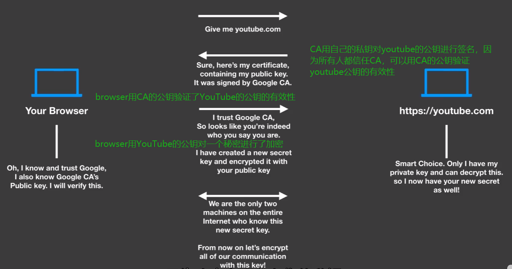
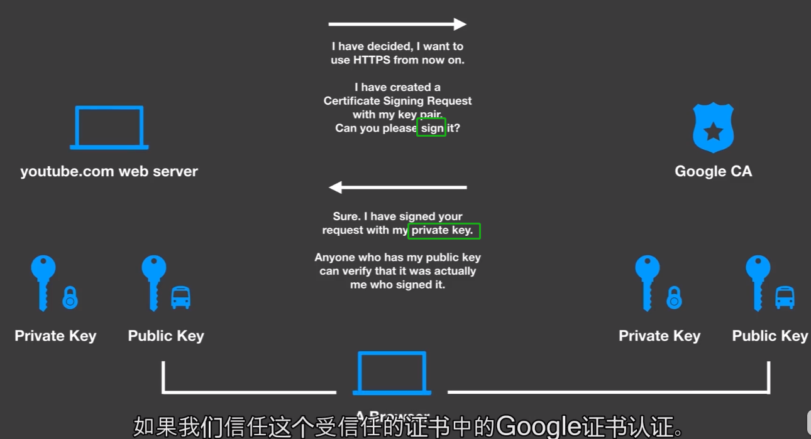

# 0 CA HTTPS应用

https进行身份验证的过程中运用到了非对称加密技术，这样保证了信息不会被窃听。

如何验证对方是否是真正的YouTube，而不是假装的呢？

- CA是所有人都信任的一个证书颁发机构，**CA使用自己的私钥对YouTube的公钥进行签名**之后，那么所有人都可以使用CA的公钥对YouTube的公钥进行验证，从而验证YouTube的公钥的真实性。
- 也就是说，把身份鉴定的工作交给了CA，网络的参与者无条件的信任CA，那么就可以把验证的工作简化为直接使用CA的公钥验证CA颁发给YouTube的证书的真实性。

总结一下：

- YouTube的identity = CA的私钥sign(youtube的公钥)
- identity可以使用证书来表示，里面包含了除了YouTube的公钥之外的其他信息

参与者得到证书的过程：

1. 自己生成一对公私钥对 
2. 自己把公钥上传给ca，并上传注册请求 
3. ca生成509证书（里面包含了我自己的公钥使用的算法和公钥），用CA自己的私钥对证书进行签名，并对公钥存档 。使用该证书的人可以通过验证CA的签名来验证证书的真实性。
4. ca把证书给我

# 1 什么是身份identity？

identity：每一个参与到区块链网络中的参与者都有一个自己的id card，该id card 封装在CA签名的X.509的数字证书中。

identity会被赋予一些权限：

* 确定了该参与者的对于信息的访问权限。
* 确定了参与者对于一些服务（智能合约中的一些函数）的使用权限。

# 2 谁来管理identity？

MSP组件：管理一个组织的参与者的有效身份。

采用传统的PKI(public key infrastructure)模型

# 3 什么是PKI？

PKI提供了一项服务：可以让网络中的参与者安全的进行通信。

## PKI的核心要素

1. 数字证书：包含了网络参与者的信息。最常见的证书格式是X.509格式。
2. 公钥私钥：保证了通信双方传递的信息的完整性。加密后的信息被篡改可被察觉。
   - 加密&解密时：不希望别人知道我的消息，所以只有我才能解密，所以可得出**对方用我的公钥加密，私钥负责解密**；
   - 签名&验证时：不希望有人冒充我发消息，只有我才能发布这个签名，所以可得出**自己用私钥签名，对方用我的公钥负责验证**。
3. CA(certificate authority)：颁发具有X.509格式的证书。**证书由 CA 的私钥进行签名**，并将参与者的公钥绑定在一起（并且可选是否具有全部属性列表）。因此，**如果一个成员信任 CA（并且知道其公钥），则可以信任与参与者绑定的证书中包含的公钥**，并通过验证参与者证书上的 CA 签名来获取所包含的属性。
4. 
5. 数字证书撤销列表：由于某些原因而被撤销的证书的引用列表。

# 4 Fabric CA Overview

[官方案例：farbic CA ](https://hyperledger-fabric-ca.readthedocs.io/en/latest/users-guide.html#table-of-contents)

访问ca server的两种方法，这两钟方法都是通过REST API完成的

1. 通过ca client
2. 通过sdk

所有的ca servers都共享一个database存储identity和certificate，如果额外部署了LDAP，那么identity信息就存储在LDAP中，而不是database中。