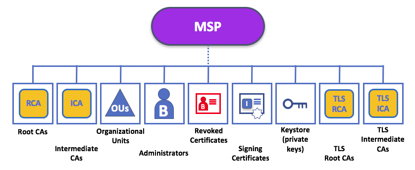

# 什么是MSP？

MSP定义的是一组规则，它规定了一些身份是可以被区块链网络的其他参与者信任的。并不是你有身份就可以参与到区块链网络中，MSP列举了哪些member可以参与到区块链网络（Channel, org, etc.）中。

即：MSP完成的是用户的权限管理的功能。

**MSP和CA之间的关系：**

- CA产生代表用身份的identity，MSP则定义了一组permissioned identity是可以合法参与到区块链网络中的。（按我的理解就是MSP决定了哪些identity是permissioned）。
- 除此之外，MSP可以给一个identity赋予一些权限，说白了MSP就是管理了一些具有某些权限的permissioned identity列表。比如每个人都有一个身份证，但是这并不代表你有参与人民代表大会的权利，而MSP维护了一个可参与人民代表大会的permissioned identity list。
  - 在用户向CA请求一个证书的时候，必须制定好该用户的权限/角色，client? admin? peer? orderer? 
- MSP由CA创建，CA专门为组织创建证书和MSP。（这句话的源头：[设置排序节点：创建组织连接](https://hyperledger-fabric.readthedocs.io/zh_CN/latest/orderer_deploy.html)）

MSP 能够通过列举member的identity的方式来识别：哪些root CA 和intermediate CA可以定义一个域内的可信成员member

* 原文：The MSP identifies which Root CAs and Intermediate CAs are accepted to define the members of a trust domain by listing the identities of their members。
* MSP也可以识别哪些CA有权利给member发放有效力的证书。


# 为什么需要MSP？

前提：Fabric是一种只有被信任的节点才能参与到其中的区块链平台，因此参与者必须证明自己的身份。

* 通过生成公钥和私钥的方法解决了怎样证明自己身份的问题。
* MSP用来解决：在不公开私钥的前提下，使网络上的其他节点信任该节点的问题。MSP定义了网络的参与者应该信任的一些组织。另外MSP给一些member提供了一些权限。


举例，在商店的支付场景中：

- CA类似于银行的角色，他负责发行银行卡；
- MSP类似政府财政部门，负责管理该商店只能用哪些银行卡进行支付。


假如你要假如到fabric区块链中，MSP能够是你参与到permissioned 区块链中的组件：

 1. 首先你要有一个 被区块链网络所信任的CA 颁发的identity证书。
  2. 成为某一个Org的一个member，你需要被链上的其他成员认可，需要将你的身份变成可以参与到区块链网络中的合法身份。
     - MSP就是怎样将你的identity身份证书 链接到该组织的membership（该组织的会员）中的一种技术。通过将member的公钥添加到org的MSP中，实现membership。
     - （The MSP is how the identity is linked to the membership of an organization. Membership is achieved by adding the member’s public key (also known as certificate, signing cert, or signcert) to the organization’s MSP.）
  3. 将MSP要么添加到consortium中，要么添加到channel中。
  4. 确保MSP包含在了网络中的policy definition里。


# MSP domains

在区块链网络中，MSP主要出现在两个不同的地方，并不是这两个MSP有不同的作用，他们都可以将identities证书赋予相应的role角色，而是说他们的作用域不同

* Local MSP 参与者本地中: 为节点（peer 或 orderer）和用户（使用CLI或使用SDK的客户端应用程序的管理员）定义的。每一个peer orderer都必须有一个local msp，因为他们必须会有相应的权限，以便在加入区块链的时候，进行权限验证。。
* Channel MSP 通道配置中: 定义的是通道级别的管理员权限 / 或者其他的权限。参与Channel的每个组织，都必须为其定义MSP。
  * Channel MSP包含加入通道的所有组织的MSP信息。Channel MSP上的Peers 和 orderers将在Channel上共享数据，并且此后将能够正确认证Channel参与者。这意味着如果一个组织希望加入该Channel，那么需要在该Channel配置中，加入一个包含该组织成员的信任链的MSP。否则来自该组织身份的交易将被拒绝。
  * **实际上，**Channel MSP在channel中的每个节点的文件系统上,实例化并且通过共识保持同步**。也就是说**，Channel通道中的每个节点的本地文件系统上存着每个channel MSP的副本。但从逻辑上来看，channel MSP驻留在channel或网络上并由其维护。Channel MSP的存在，使得加入通道中的所有节点之间的数据共享。
  * **通过将组织的 MSP 添加到通道配置中，可以表示该组织加入了通道。**

下图为区块链管理员安装和实例化智能合约时所发生的情况，通道由 ORG1 和 ORG2 管理。


1. 管理员 `B` 使用身份连接到peer节点上，该身份是由`RCA1`颁发的，存储在本地 MSP中。
2. 当 `B` 试图在节点上安装智能合约时，该peer节点检查其本地 MSP `ORG1-MSP`，以验证 `B` 的身份确实是 `ORG1` 的成员。验证成功后才会允许安装。
3. 随后，`B` 希望在通道上实例化智能合约。
4. 因为这是一个通道操作，所以通道上的所有组织都必须同意该操作。
5. 因此，节必须检查该通道的 MSP。
6. 节点成功提交此命令。


**本地 MSP 只被定义在它们应用到的节点或用户的文件系统上**。

因此，从物理和逻辑上来说，每个节点或用户只有一个本地 MSP。

但是，由于通道 MSP 对通道中的所有节点都可用，因此在逻辑上他们只在通道配置中定义一次。

然而，**通道 MSP 也在通道中每个节点的文件系统上实例化，并通过共识来保持同步**。

因此，虽然每个节点的本地文件系统上都有各通道 MSP 的副本，但从逻辑上讲，通道 MSP 驻留在通道或网络上并由通道或网络进行维护。

## Local MSP

Local MSP 是为client，和node（peer 和 orderer）设计的：

- 节点本地 MSP 为该节点定义权限（例如，是否具有管理员权限）。
- 节点的本地 MSP 允许用户端在其交易中作为通道的成员（例如在链码交易中）或作为系统中特定角色的所有者（例如在配置交易中的某组织管理员）对用户进行身份验证。

MSP定义了谁拥有该级别的管理或参与权（节点管理员不一定是通道管理员，反之亦然），Local MSP为节点（peer 或 orderer）和用户（使用CLI或使用SDK的客户端应用程序的管理员）定义的。每一个peer orderer都必须有一个local msp，因为他们必须会有相应的权限，以便在加入区块链的时候，进行权限验证。。

## Channel MSP

channel msp 定义了通道级别的管理权，和参与权，每个参与通道的组织都必须有一个Channel MSP（规定了谁可以代表该组织）：

* 通道上的 Peer 节点和排序节点将共享通道 MSP，因此能够正确地对通道参与者进行身份验证。
  * Channel MSP包含加入通道的所有组织的MSP信息。Channel MSP上的Peers 和 orderers将在Channel上共享数据，并且此后将能够正确认证Channel参与者。这意味着如果一个组织希望加入该Channel，那么需要在该Channel配置中，加入一个包含该组织成员的信任链的MSP。否则来自该组织身份的交易将被拒绝。
  * **实际上，**Channel MSP在channel中的每个节点的文件系统上,实例化并且通过共识保持同步**。也就是说**，Channel通道中的每个节点的本地文件系统上存着每个channel MSP的副本。但从逻辑上来看，channel MSP驻留在channel或网络上并由其维护。Channel MSP的存在，使得加入通道中的所有节点之间的数据共享。
* 如果某个组织希望加入通道，则需要在通道配置中加入一个包含该组织成员信任链的 MSP，可以表示该组织加入了通道。否则，由该组织身份发起的交易将被拒绝。


*A channel config.json file includes two organization MSPs*

The system channel MSP 包含了参与到同一个ordering service的所有组织的MSP。这里所指的ordering service 是指一个orderer node集群所提供的服务。

## Existence of  Local MSP and Channel MSP

- Local MSP定义在client或node(peer / order)中的文件系统上，因此对于每一个节点来将，都只有一个Local MSP，来管理它的权限。
- Channel MSP也定义在各个节点的文件系统上，于local msp所不同的是，同一个Channel的各个节点所维护的Channel MSP是相同的一致的。


In this figure:

- the network system channel is administered by ORG1, 
- but another application channel can be managed by ORG1 and ORG2. 
- The peer is a member of and managed by ORG2, whereas ORG1 manages the orderer of the figure. 
- ORG1 trusts identities from RCA1, whereas ORG2 trusts identities from RCA2. 
- while ORG1 administers the network, ORG2.MSP does exist in the network definition.


- **网络 MSP** ：一个网络的配置文件，通过定义参与组织的 MSP 定义了谁是这个网络中的成员，并且定义了这些成员中的哪些被授权来执行相关管理任务 （比如，创建一个通道）。
- **通道 MSP**：对于一个通道来说，保持其成员MSP的不同至关重要。通道为一群特定组织提供了一个彼此间私有的通信方式，这些组织又对这个通道进行管理。该通道 MSP 中所解释的通道策略定义了谁有能力参与该通道上的某些操作，比如，添加组织或者实例化链码。注意，管理通道的权限和管理网络配置通道（或任何其他通道）的能力之间没有必然联系。管理权仅存在于被管理的范围内。
- **Peer 节点 MSP**：这个本地 MSP 是在每个节点的文件系统上定义的，并且每个节点都有一个单独的 MSP 实例。从概念上讲，该MSP和通道 MSP 执行着完全一样的操作，但仅适用于其被定义的节点。在节点上安装一个链码，这个就是使用节点的本地 MSP 来判定谁被授权进行某个操作的例子。
- **排序节点 MSP**： 就和Peer 节点 MSP 一样，排序节点的本地 MSP 也是在节点的文件系统上定义的，并且只会应用于这个节点。同时，排序节点也是由某个单独的组织所有，因此具有一个单独的 MSP 用于罗列它所信任的操作者或者节点。

# Org - MSP

org使用一个MSP管理org中的所有的member

## Organizational Units(OUs) an MSP

每个组织可能由于业务原因分为多个OU organization units，每一个ou都有不同的责任（比如一个组织可能有营销部或市场部）。

当ca颁布一个证书时，证书里的OU字段表示了该identity属于哪一个业务部。这样做的好处就是可以进行更细粒度的权限控制。

## Node OU 

没怎么看懂，仔细看一下

Node OU can be used to confer a role onto an identity. Node OU roles are defined in the $FABRIC_CFG_PATH/msp/config.yaml file and contain a list of organizational units whose members are considered to be part of the organization represented by this MSP.

- This is particularly useful when you want to restrict the members of an organization to the ones holding an identity (signed by one of MSP designated CAs) with a specific Node OU role in it.
- For example, with node OU’s you can implement a more granular endorsement policy that requires Org1 peers to endorse a transaction, rather than any member of Org1.


The default MSP implementation allows organizations to further classify identities into clients, admins, peers, and orderers based on the OUs of their x509 certificates.

- An identity should be classified as a **client** if it transacts on the network.
- An identity should be classified as an **admin** if it handles administrative tasks such as joining a peer to a channel or signing a channel configuration update transaction.
- An identity should be classified as a **peer** if it endorses or commits transactions.
- An identity should be classified as an **orderer** if belongs to an ordering node.

In order to define the clients, admins, peers, and orderers of a given MSP, the `config.yaml` file needs to be set appropriately. You can find an example NodeOU section of the `config.yaml` file below:

```yaml
NodeOUs:
  Enable: true
  ClientOUIdentifier:
    Certificate: "cacerts/cacert.pem"
    OrganizationalUnitIdentifier: "client"
  AdminOUIdentifier:
    Certificate: "cacerts/cacert.pem"
    OrganizationalUnitIdentifier: "admin"
  PeerOUIdentifier:
    Certificate: "cacerts/cacert.pem"
    OrganizationalUnitIdentifier: "peer"
  OrdererOUIdentifier:
    Certificate: "cacerts/cacert.pem"
    OrganizationalUnitIdentifier: "orderer"
```

Identity classification is enabled when `NodeOUs.Enable` is set to `true`（如在fabric-samples/firstnetwork/cryto-config.yaml）. Then the client (admin, peer, orderer) organizational unit identifier is defined by setting the properties of the `NodeOUs.ClientOUIdentifier` (`NodeOUs.AdminOUIdentifier`, `NodeOUs.PeerOUIdentifier`, `NodeOUs.OrdererOUIdentifier`) key:

1. `OrganizationalUnitIdentifier`: Is the OU value that the x509 certificate needs to contain to be considered a client (admin, peer, orderer respectively). If this field is empty, then the classification is not applied.
2. `Certificate`: Set this to the path of the CA or intermediate CA certificate under which client (peer, admin or orderer) identities should be validated. The field is relative to the MSP root folder. This field is optional. You can leave this field blank and allow the certificate to be validated under any CA defined in the MSP configuration.

Notice that if the `NodeOUs.ClientOUIdentifier` section (`NodeOUs.AdminOUIdentifier`, `NodeOUs.PeerOUIdentifier`, `NodeOUs.OrdererOUIdentifier`) is missing, then the classification is not applied. If `NodeOUs.Enable` is set to `true` and no classification keys are defined, then identity classification is assumed to be disabled.

Identities can use organizational units to be classified as either a client, an admin, a peer, or an orderer. The four classifications are mutually exclusive. The 1.1 channel capability needs to be enabled before identities can be classified as clients or peers. The 1.4.3 channel capability needs to be enabled for identities to be classified as an admin or orderer.

Classification allows identities to be classified as admins (and conduct administrator actions) without the certificate being stored in the `admincerts` folder of the MSP. Instead, the `admincerts` folder can remain empty and administrators can be created by enrolling identities with the admin OU. Certificates in the `admincerts` folder will still grant the role of administrator to their bearer, provided that they possess the client or admin OU.


Note: For Channel MSPs, just because an actor has the role of an administrator it doesn’t mean that they can administer particular resources. The actual power a given identity has with respect to administering the system is determined by the policies that manage system resources. 

- For example, a channel policy might specify that ORG1-MANUFACTURING administrators, meaning identities with a role of admin and a Node OU of ORG1-MANUFACTURING, have the rights to add new organizations to the channel, whereas the ORG1-DISTRIBUTION administrators have no such rights.


# **MSP Structure** 




- **根 CA**：该文件夹包含了根CA自主签名的X.509证书的列表，其中的根CA是受MSP代表的组织所信任的。在这个 MSP 文件夹中至少要有一个根 CA X.509 证书。

  这是最重要的一个文件夹，因为它指出了所有可用于证明成员属于对应组织的其他证书的来源 CA。

- **中间 CA**：该文件夹包含了受这个组织信任的中间 CA 对应的 X.509 证书列表。其中每个证书的签发方必须是MSP中的某个根CA或中间CA，若是中间CA，则该中间 CA 的证书签发 CA 信任链必须最终能够连上一个受信任的根 CA。

  中间 CA 可能代表了组织中不同的一个分支（就像 `ORG1` 有 `ORG1-MANUFACTURING` 和 `ORG1-DISTRIBUTION`一样）， 也可能代表了这个组织自身（比如当一个商业 CA 被用来管理组织的身份时）。在后边这个情况中，中间 CA 可以被用来代表组织的分支。从[这里](https://hyperledger-fabric.readthedocs.io/zh_CN/release-1.4/msp.html)你或许能看到更多关于 MSP 配置最佳实践的信息。

  就像根 CA 文件夹一样，中间CA文件夹定义了可用于证明组织成员身份的证书的签发CA。

- **组织单元 （OU）**：组织单元被列在 `$FABRIC_CFG_PATH/msp/config.yaml` 文件中，包含了组织单元的一个列表，其中的成员被认为是由这个 MSP 所代表的组织的一部分。当你想要把一个组织的成员限定为持有一个其中包含某特定组织单元的身份（由MSP指定的某个CA签发）的成员时，它是很有用的。

  ```yaml
  NodeOUs:
    Enable: true # 开启身份分类
    ClientOUIdentifier: # 定义client(或peer)的身份
      Certificate: "cacerts/cacert.pem" # 将其设置为指定的client(或peer)的CA证书或中间CA证书路径来得到验证。该路径是相对MSP根目录的。如果该路径为空，说明该身份的X.509证书可以被任何MSP配置中的CA所验证。
      OrganizationalUnitIdentifier: "client" # 将其设置成与clinet(或peer)的X.509证书所包含的OU匹配
    PeerOUIdentifier:
      Certificate: "cacerts/cacert.pem"
      OrganizationalUnitIdentifier: "peer"
  ```

  

- **管理员**：该文件夹包含了一个身份证书列表，**其中的证书身份为该组织定义了哪些操作者担任管理员**。

  对于一个给定身份证书来说，它**在管理系统方面的实际能力是由管理系统资源的相关策略决定**的。比如，一个通道策略可能会指明 `ORG1-MANUFACTURING` 管理员有权利来向通道中添加新的组织，然而 `ORG1-DISTRIBUTION` 管理员却没有这个权利。

  虽然 X.509 证书具有 `ROLE` 属性（比如，明确规定一个操作者是一个 `admin`），但是该属性指的是操作者在其组织内所扮演的角色，而不是在区块链网络上。这一点与`OU` 属性的目的类似，若已经定义`OU` 属性，则其指的是操作者在组织中的位置。

  如果某个通道策略允许来自一个（或某些）组织的任何管理员执行某些通道功能的话，那么`ROLE` 属性就**能够**用来授予该通道级别上的管理权力。这样的话，一个组织层面的角色可以授予一个网络级别的角色。

- **撤销证书**：如果一个参与者的身份被撤销，那么该身份的识别信息（不是指身份本身）就会被储存在这个文件夹中。对基于 X.509 的身份来说，这些标识符就是主体密钥标识符 （Subject Key Identifier，SKI） 和权限访问标识符（Authority Access Identifier，AKI）的字符串对，并且无论何时使用 X.509 证书，都会检查这些标识符，以确保证书未被撤销。

  虽然这个列表在概念上跟 CA 的证书撤销列表 （CRL） 是一样的，但是它还和从组织中撤销成员有关。这样一来，本地或通道 MSP 的管理员通过广播被撤销证书的发行CA的最新CRL，就可以迅速将这个参与者或者节点从组织中撤销。罗列这一列表并不是必须的，只有在证书要撤销的时候才会用到。

- **节点身份**：这个文件夹包含了节点的身份，比如，与`KeyStore`内容结合使用的加密材料将允许节点在向同通道或同网络上其他参与者发送的信息中验证自己的身份。对基于 X.509 的身份来说， 该文件夹包含了一个 **X.509 证书**。Peer节点会把这一证书放置到交易提案的响应中，比如，来表明该节点已经为此交易背书，在接下来的验证阶段会根据交易的背书策略来验证这一背书。

  本地 MSP 中必须拥有”节点身份“文件夹，节点中有且仅有一个X.509 证书。而通道 MSP中不使用该文件夹 。

- **私钥的 `KeyStore`**：这个文件夹是为 Peer 节点或者排序节点（或者在客户端的本地 MSP 中） 的本地 MSP 定义的，其中包含了节点的**签名秘钥**。这个秘钥与**节点身份**文件夹里的节点身份能以密码方式匹配，可用来对数据进行签名，比如在背书阶段对一个交易提案的响应进行签名。

  本地 MSP 必须有这个文件夹，而且该文件夹必须包含且仅包含一个私钥。很显然，这个文件夹的访问权限必须限定在对这个节点有管理权限的用户的身份。

  因为通道 MSP 的目标只是提供身份验证功能，而不是签名的能力，所以**通道 MSP** 的配置中不包含这个文件夹。

- **TLS 根 CA**：该文件夹包含了根CA的自主签名X.509证书的列表，其中的根CA是受该组织信任来**进行TLS通信**的。一个 TLS 通信的例子就是，Peer 节点为接受到更新过的账本， 需要连接到一个排序节点，这时就会发生TLS通信。

  MSP TLS 信息和网络内部的节点（Peer 节点和排序节点）有关联，换句话说，它与使用该网络的应用程序和管理员无关。

  这个文件夹中必须有至少一个 TLS 根 CA X.509 证书。

- **TLS 中间 CA**：这个文件夹包含了**在通信时**这个 MSP 所代表的的组织所信任的中间 CA 证书列表。当商业 CA 被用于一个组织的 TLS 证书时，该文件夹特别有用。跟成员的中间 CA 类似，指定中间 TLS CA 是可选项。

  关于 TLS 的更多信息，点击[这里](https://hyperledger-fabric.readthedocs.io/zh_CN/release-1.4/enable_tls.html)。


# MSP 实践

注意每个实体（组织、节点、用户）最终都会拥有 MSP 来代表身份信息，其中包括三种证书：

1. 管理员身份的验证证书、
2. 实体信任的 CA 的根证书、
3. 自身身份验证（检查签名）的证书。
4. 此外，还包括对应身份验证的签名用的私钥。

```
crypto-config
|-- ordererOrganizations
...
...
...
`-- peerOrganizations
    |-- org1.example.com # 存放第一个组织的相关材料，每个组织会生成单独的根证书。
    |   |-- ca # 存放组织的根证书和对应的私钥文件，默认采用 EC 算法，证书为自签名。组
织内的实体将基于该根证书作为相同的证书根。
    |   |-- msp 存放代表该组织的身份信息
    |   |   |-- admincerts 组织管理员的身份验证证书。
    |   |   |-- cacerts 组织的根证书。
    |   |   `-- tlscacerts
    |   |-- peers 存放该组织下的所有 peer 节点
    |   |   |-- peer0.org1.example.com 第一个 peer 的信息，包括 msp 证书和 tls 证书两类。
    |   |   |   |-- msp
    |   |   |   |   |-- admincerts 组织管理员的身份验证证书。
    |   |   |   |   |-- cacerts 存放组织的根证书。
    |   |   |   |   |-- keystore 本节点的身份私钥，用来签名。
    |   |   |   |   |-- signcerts 验证本节点签名的证书，被组织根证书签名。
    |   |   |   |   `-- tlscacerts
    |   |   |   `-- tls
    |   |   `-- peer1.org1.example.com
    |   |       |-- msp
    |   |       |   |-- admincerts
    |   |       |   |-- cacerts
    |   |       |   |-- keystore
    |   |       |   |-- signcerts
    |   |       |   `-- tlscacerts
    |   |       `-- tls
    |   |-- tlsca
    |   `-- users 
    |       |-- Admin@org1.example.com 管理员用户的信息，包括 msp 证书和 tls 证书两类。
    |       |   |-- msp 
    |       |   |   |-- admincerts 组织根证书作为管理者身份验证证书。
    |       |   |   |-- cacerts 存放组织的根证书。
    |       |   |   |-- keystore 本用户的身份私钥，用来签名。
    |       |   |   |-- signcerts 管理员用户的身份验证证书，被组织根证书签名。
    |       |   |   `-- tlscacerts
    |       |   `-- tls
    |       `-- User1@org1.example.com
    |           |-- msp
    |           |   |-- admincerts
    |           |   |-- cacerts
    |           |   |-- keystore
    |           |   |-- signcerts
    |           |   `-- tlscacerts
    |           `-- tls
    `-- org2.example.com
        |-- ...
```


