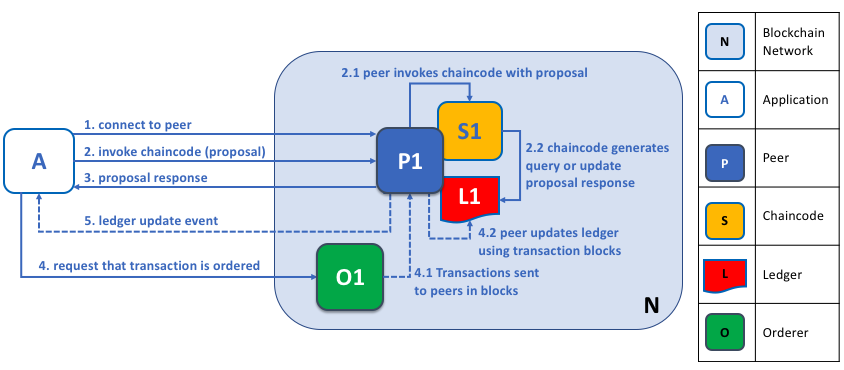

# Peer上有什么？

Peer其实是运行账本和智能合约的实例：

- 智能合约
- 账本

# Application and Peer

app提交交易流程：

1. Hyperledger Fabric SDK 通过 APIs 使应用程序能够连接到 peers。
   application生成交易提案proposal。

2. 在交易提案能够被网络所接受之前，app必须得到背书策略所指定的peers的背书。peer使用交易提案来调用 chaincode，从而生成交易的proposal response。

3. application接收到了一定数量经过背书后的proposal responses。

4. application提交交易到order网络，在网络中交易会被排序

   orderer提交到peer中的分布式账本中。

   注：不是每个 Peer 节点都需要连接到一个排序节点，只需要一个peer主节点连接到order就可以了，然后Peer中的主节点可以使用 gossip 协议将区块关联到其他节点。（gossip的另外一个应用就是组织间的peer的相互通信）
   每个peer节点将独立地以确定的方式验证区块，以确保账本保持一致。具体来说，通道中每个peer节点都将验证区块中的每个交易，以确保得到了所需组织的节点背书，也就是peer节点的背书和背书策略相匹配，并且不会因最初认可该事务时可能正在运行的其他最近提交的事务而失效。无效的交易仍然保留在排序节点创建的区块中，但是节点将它们标记为无效，并且不更新账本的状态。

5. 在这个流程结束的时候接收到更新事件

# Peer and Channels

channel 提供了各个节点进行信息交互的工具。

# Peer and Org

Hyperledger Fabric 允许一个组织利用**通道**同时参与多个、彼此独立的区块链网络。通过加入多个通道，一个组织可以参与一个所谓的**网络的网络**。通道在维持数据和通信隐私的同时还提供了高效的基础设施共享。通道是足够独立的，可以帮助组织将自己的工作流量与其他组织的分开，同时它还具有足够的协调性，在必要时能够协调各个独立的活动。

- 应用程序或者会连接到他们组织的 peers 或者其他组织的 peers，取决于所需的账本交互的特点。
- 对于查询账本的交互，应用程序通常会连接到他们自己的组织的 peers。
- 对于更新账本的交互，应用程序需要连接到代表 *每一个* 被要求为账本更新进行背书的组织的 peers。

# Peer and Identity

当一个 peer 连接到一个 channel 的时候，它的数字证书会通过一个 channel MSP 来识别它的所属组织，在 channel 配置中的一个策略会使用 peer 的身份信息来确定它的权利。

- 在这个例子中，P1 和 P2 具有由 CA1 颁发的身份信息。
- Channel C 通过在它的 channel 配置中的一个策略来决定来自于 CA1 的身份信息应该使用 ORG1.MSP 被关联到 Org1。类似的，P3 和 P4 由 ORG2.MSP 识别为 Org2 的一部分。

关于身份信息和组织的 mapping 是由MSP来提供的，也就是说在一个独立的身份信息和一个指定的组织角色之间的提供关联。

- MSP决定 peer 是如何在一个指定的组织中分配到一个指定的角色，以及得到访问区块链资源的相关权限。
- 一个 peer 只能被一个组织所有，因此也就只能被关联到一个单独的 MSP。

Peers、应用程序、终端用户、管理员以及排序节点如果想同一个区块链网络进行交互的话，必须要有一个身份信息和一个想关联的 MSP。

# Peer and Order

在一个账本的更新被更新到一个 peer 的本地账本之前，一个 peer 会请求网络中的其他 peers 来批准这次更新。这个过程被称为 *共识*。当所有被要求提供批准的节点都提供了批准也就是完成了共识，并且这笔交易被提交到账本的时候，peer 会通知它连接的应用程序，账本已经更新了。

