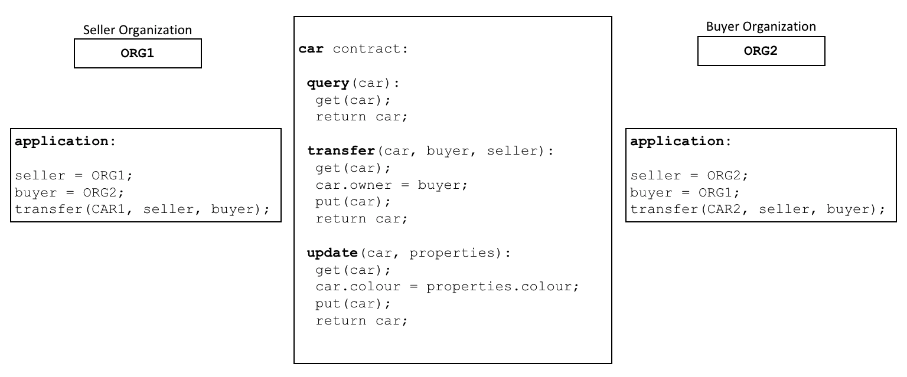

# Smart Contract

Fabric的核心：

- 智能合约：将状态更新到账本的可执行逻辑。
- 账本：一组业务对象的当前状态和历史状态的事实。

智能合约用可执行的代码定义了不同组织之间的规则。应用程序调用智能合约来生成被记录到账本上的交易。

# Chaincode

智能合约与链码的区别：**智能合约是一个特定领域的程序**，它与特定的业务流程相关，而**链码则是一组相关智能合约安装和实例化的`技术容器`**。

- 一个智能合约定义在一个链码中。
- 多个智能合约也可以定义在同一个链码中。
- 当一个链码部署完毕，该链码中的所有智能合约都可供应用程序使用。

# 账本

账本的两个不同的部分：

1. 区块链：智能合约可以在区块链中查询不可篡改的区块链历史交易记录。
2. 世界状态：智能合约主要在世界状态中进行写入，读取，和删除。

# 背书

每个链码都有一个背书策略与之相关联，该背书策略适用于此链码中定义的所有智能合约。

背书策略非常重要，它指明了区块链网络中哪些组织必须对一个智能合约所生成的交易进行签名，以此来宣布该交易有效。

如果一项背书策略指定，必须有不止一个组织来签署交易，那么只有当足够数量的组织都执行了智能合约，才能够生成有效交易。

## Fabric区别于其他区块链

- 背书策略是 Hyperledger Fabric 与以太坊（Ethereum）或比特币（Bitcoin）等其他区块链的区别所在。
- 在这些公有链区块链系统中，网络上的任何节点都可以生成有效的交易。
- 而 Hyperledger Fabric 更真实地模拟了现实世界；交易必须由 Fabric 网络中受信任的组织验证。例如，一个政府组织必须签署一个有效的 issueIdentity 交易，或者一辆车的 buyer 和 seller 都必须签署一个 car 转移交易。
- 背书策略的设计旨在让 Hyperledger Fabric 更好地模拟这些真实发生的交互。

# 有效交易

一项交易被分发给网络中的所有节点，各节点通过两个阶段对其进行**验证**。

1. 首先，**根据背书策略检查交易**，确保该交易已被足够的组织签署。
2. 其次，继续检查交易，以**确保当该交易在受到背书节点签名时它的交易读集与世界状态的当前值匹配**，并且中间过程中没有被更新。
3. 如果一个交易通过了这两个测试，它就被标记为**有效**。所有交易，不管是**有效的**还是**无效的**，都会被添加到区块链历史中，但是仅**有效的**交易才会更新世界状态。

# 通道

通道在一群组织之间提供了一种完全独立的通信机制。

1. 链码定义是一种包含了许多参数的结构，这些参数管理着链码的运行方式，包含着链码名、版本以及背书策略。
2. 各通道成员批准各自组织的一个链码定义，以表示其对该链码的参数表示同意。
3. 当足够数量（默认是多数）的组织都已批准同一个链码定义，该定义可被提交至这些组织所在的通道。
4. 随后，通道成员可依据该链码定义中指明的背书策略来执行其中的智能合约。这个背书策略可同等使用于在相同链码中定义的所有智能合约。
5. 当链码定义被提交到通道上后，该通道上所有的应用程序都可以使用此链码中的智能合约。

