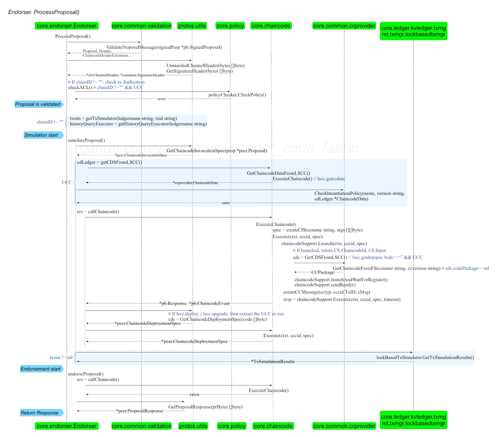

# 读取k-v state db 源码解析

需要解决的问题：

1. 需要解决从链中读取数据容器之间互相调用服务的关系


！！！因为调用关系很多，这里只罗列核心代码！！！

展示的代码并不包括：

- 初始变量定义部分
- 判断语句执行异常部分

展示的代码尽可能精简地包括：

- 核心调用过程
  - ps：核心调用过程有时调用层次过多，为了尽可能的展示系统逻辑，调用过程可能会省略

# 1 客户端容器提出查询请求proposal

## 1.生成查询命令

byfn.sh-networkUp() 中在cli容器中执行交易脚本

```yaml
docker exec cli scripts/script.sh $CHANNEL_NAME $CLI_DELAY $CC_SRC_LANGUAGE $CLI_TIMEOUT $VERBOSE $NO_CHAINCODE
```

cli执行script.sh，下面向peer0.org1发送了一个查询请求

```yaml
chaincodeQuery 0 1 100
```

utils.sh-chaincodeQuery实现

```yaml
peer chaincode query -C $CHANNEL_NAME -n mycc -c '{"Args":["query","a"]}' >&log.txt
```

主要原理是调用了bin/peer工具生成一个proposal，发送给peer


## 2.客户端peer工具的调用入口

1. 在cmd\peer\main.go中，我们可以看到peer工具的main()入口，从这个入口我们可以看到客户端是怎么生成一个proposal并分发给peer的。

```go
func main() {
	// For environment variables.
	// 读环境变量
    
    // 添加第二级指令
	mainCmd.AddCommand(version.Cmd())
	mainCmd.AddCommand(node.Cmd())
	mainCmd.AddCommand(chaincode.Cmd(nil, cryptoProvider))
	mainCmd.AddCommand(channel.Cmd(nil))
	mainCmd.AddCommand(lifecycle.Cmd(cryptoProvider))

    // 执行
	// On failure Cobra prints the usage message and error string, so we only
	// need to exit with a non-0 status
	if mainCmd.Execute() != nil {
		os.Exit(1)
	}
}
```

2. 这里只调查链码调用命令，进入peer chaincode命令

```go
// Cmd returns the cobra command for Chaincode
func Cmd(cf *ChaincodeCmdFactory, cryptoProvider bccsp.BCCSP) *cobra.Command {
	addFlags(chaincodeCmd)

	chaincodeCmd.AddCommand(installCmd(cf, nil, cryptoProvider))
	chaincodeCmd.AddCommand(instantiateCmd(cf, cryptoProvider))
	chaincodeCmd.AddCommand(invokeCmd(cf, cryptoProvider))
	chaincodeCmd.AddCommand(packageCmd(cf, nil, nil, cryptoProvider))
	chaincodeCmd.AddCommand(queryCmd(cf, cryptoProvider))
	chaincodeCmd.AddCommand(signpackageCmd(cf, cryptoProvider))
	chaincodeCmd.AddCommand(upgradeCmd(cf, cryptoProvider))
	chaincodeCmd.AddCommand(listCmd(cf, cryptoProvider))

	return chaincodeCmd
}
```

3. 这里只调查query命令，查看query命令详情

```go
// queryCmd returns the cobra command for Chaincode Query
func queryCmd(cf *ChaincodeCmdFactory, cryptoProvider bccsp.BCCSP) *cobra.Command {
	chaincodeQueryCmd = &cobra.Command{
		Use:       "query",
		Short:     fmt.Sprintf("Query using the specified %s.", chainFuncName),
		Long:      fmt.Sprintf("Get endorsed result of %s function call and print it. It won't generate transaction.", chainFuncName),
		ValidArgs: []string{"1"},
        // 这个地方比较重要，添加了执行命令的函数 chaincodeQuery()
		RunE: func(cmd *cobra.Command, args []string) error {
			return chaincodeQuery(cmd, cf, cryptoProvider)
		},
	}
	flagList := []string{
		...
	}
	attachFlags(chaincodeQueryCmd, flagList)

	return chaincodeQueryCmd
}
```

## 3.生成proposal并得到proposal 

接上面，可以看到chaincodeQuery是执行具体逻辑的过程。

1. 查看执行peer chaincode query命令时，具体做了什么

```go
func chaincodeQuery(cmd *cobra.Command, cf *ChaincodeCmdFactory, cryptoProvider bccsp.BCCSP) error {
	...
	return chaincodeInvokeOrQuery(cmd, false, cf)
}
```


！！！核心代码---发送proposal---得到proposal response！！！


2. 在chaincodeInvokeOrQuery中，生成具体的proposal，并发送给peer节点，然后从peer节点那里拿到proposal response

```go
func chaincodeInvokeOrQuery(cmd *cobra.Command, invoke bool, cf *ChaincodeCmdFactory) (err error) {
	spec, err := getChaincodeSpec(cmd)
	if err != nil {
		return err
	}

	// call with empty txid to ensure production code generates a txid.
	// otherwise, tests can explicitly set their own txid
	txID := ""

	proposalResp, err := ChaincodeInvokeOrQuery(
		spec,
		channelID,
		txID,
		invoke,
		cf.Signer,
		cf.Certificate,
		cf.EndorserClients,
		cf.DeliverClients,
		cf.BroadcastClient,
	)

	if invoke {
		
	} else {
		// 输出结果
		fmt.Println(string(proposalResp.Response.Payload))
	}
	return nil
}
```

3. 生成proposal和得到proposal response的过程

```go
// ChaincodeInvokeOrQuery invokes or queries the chaincode. If successful, the
// INVOKE form prints the ProposalResponse to STDOUT, and the QUERY form prints
// the query result on STDOUT. A command-line flag (-r, --raw) determines
// whether the query result is output as raw bytes, or as a printable string.
// The printable form is optionally (-x, --hex) a hexadecimal representation
// of the query response. If the query response is NIL, nothing is output.
//
// NOTE - Query will likely go away as all interactions with the endorser are
// Proposal and ProposalResponses
func ChaincodeInvokeOrQuery(
	spec *pb.ChaincodeSpec,
	cID string,
	txID string,
	invoke bool,
	signer identity.SignerSerializer,
	certificate tls.Certificate,
	endorserClients []pb.EndorserClient,
	deliverClients []pb.DeliverClient,
	bc common.BroadcastClient,
) (*pb.ProposalResponse, error) {
	// Build the ChaincodeInvocationSpec message
	invocation := &pb.ChaincodeInvocationSpec{ChaincodeSpec: spec}

	// 生成proposal
	prop, txid, err := protoutil.CreateChaincodeProposalWithTxIDAndTransient(pcommon.HeaderType_ENDORSER_TRANSACTION, cID, invocation, creator, txID, tMap)

    // 对proposal进行签名
	signedProp, err := protoutil.GetSignedProposal(prop, signer)

    // ！！！关键语句！！！
    // 发送proposal，并拿到response
	// ！！！关键语句！！！
    responses, err := processProposals(endorserClients, signedProp)

	// all responses will be checked when the signed transaction is created.
	// for now, just set this so we check the first response's status
	proposalResp := responses[0]

    // 插播：下面的和查询无关，是和插入交易相关的。
    // 如果是插入一笔交易的话，invoke。还需要将proposal response 转化为一个signed tx封装到envelope中发送给orderer打包成块，上传到链。
	if invoke {
		if proposalResp != nil {
			
			// assemble a signed transaction (it's an Envelope message)
			env, err := protoutil.CreateSignedTx(prop, signer, responses...)
            
			var dg *DeliverGroup
			var ctx context.Context
			if waitForEvent {
				var cancelFunc context.CancelFunc
				ctx, cancelFunc = context.WithTimeout(context.Background(), waitForEventTimeout)
				defer cancelFunc()

				dg = NewDeliverGroup(
					deliverClients,
					peerAddresses,
					signer,
					certificate,
					channelID,
					txid,
				)
				// connect to deliver service on all peers
				err := dg.Connect(ctx)
			}

			// send the envelope for ordering
			if err = bc.Send(env); err != nil {
				return proposalResp, errors.WithMessagef(err, "error sending transaction for %s", funcName)
			}

			if dg != nil && ctx != nil {
				// wait for event that contains the txid from all peers
				err = dg.Wait(ctx)
				if err != nil {
					return nil, err
				}
			}
		}
	}

	return proposalResp, nil
}
```

5. 发送proposal，并等待proposal response
   - 注意这里是给一批peer发送，并得到结果

```go
// processProposals sends a signed proposal to a set of peers, and gathers all the responses.
func processProposals(endorserClients []pb.EndorserClient, signedProposal *pb.SignedProposal) ([]*pb.ProposalResponse, error) {
	responsesCh := make(chan *pb.ProposalResponse, len(endorserClients))
	errorCh := make(chan error, len(endorserClients))
	wg := sync.WaitGroup{}
	for _, endorser := range endorserClients {
		wg.Add(1)
		go func(endorser pb.EndorserClient) {
			defer wg.Done()
			proposalResp, err := endorser.ProcessProposal(context.Background(), signedProposal)
			if err != nil {
				errorCh <- err
				return
			}
			responsesCh <- proposalResp
		}(endorser)
	}
	wg.Wait()
	close(responsesCh)
	close(errorCh)
	for err := range errorCh {
		return nil, err
	}
	var responses []*pb.ProposalResponse
	for response := range responsesCh {
		responses = append(responses, response)
	}
	return responses, nil
}
```

6. 在fabric\vendor\github.com\hyperledger\fabric-protos-go\peer\peer.pb.go中，发送proposal和接受

```go
func (c *endorserClient) ProcessProposal(ctx context.Context, in *SignedProposal, opts ...grpc.CallOption) (*ProposalResponse, error) {
	out := new(ProposalResponse)
    // 开启grpc远程过程调用
	err := c.cc.Invoke(ctx, "/protos.Endorser/ProcessProposal", in, out, opts...)
	if err != nil {
		return nil, err
	}
	return out, nil
}
```

7. grpc远程过程调用

```go
/ Invoke sends the RPC request on the wire and returns after response is
// received.  This is typically called by generated code.
//
// All errors returned by Invoke are compatible with the status package.
func (cc *ClientConn) Invoke(ctx context.Context, method string, args, reply interface{}, opts ...CallOption) error {
	// allow interceptor to see all applicable call options, which means those
	// configured as defaults from dial option as well as per-call options
	opts = combine(cc.dopts.callOptions, opts)

	if cc.dopts.unaryInt != nil {
		return cc.dopts.unaryInt(ctx, method, args, reply, cc, invoke, opts...)
	}
	return invoke(ctx, method, args, reply, cc, opts...)
}
```

```go
func invoke(ctx context.Context, method string, req, reply interface{}, cc *ClientConn, opts ...CallOption) error {
	cs, err := newClientStream(ctx, unaryStreamDesc, cc, method, opts...)
	if err != nil {
		return err
	}
	if err := cs.SendMsg(req); err != nil {
		return err
	}
	return cs.RecvMsg(reply)
}
```


# 2 Peer容器收到proposal

## 1 peer容器开始处理proposal

1.首先peer节点会现在容器中完成peer节点的启动工作：

```yaml
services:
  peer-base:
    image: hyperledger/fabric-peer:$IMAGE_TAG
    environment:
      ...
    working_dir: /opt/gopath/src/github.com/hyperledger/fabric/peer
    command: peer node start
```

在fabric\internal\peer\node\start.go中有详细启动的源码解释，有点复杂，将会在另外一个专题详细讨论，这里并不展开

[示意图](https://github.com/yeasy/hyperledger_code_fabric/tree/master/peer/node)

总之在peer节点启动之后，可以监听grpc端口，接受client发送过来的具体proposal


2.处理客户端产生的proposal，ProcessProposal

Peer 接收到请求后，会调用 fabric/core/endorser/endorser.go 中 Endorser 结构体的 ProcessProposal方法，进行具体的背书处理。

ProcessProposal的定义如下，返回值是ProposalResponse

```go
// ProcessProposal process the Proposal
func (e *Endorser) ProcessProposal(ctx context.Context, signedProp *pb.SignedProposal) (*pb.ProposalResponse, error) {
    ...
	0. 检查提案消息的合法性，以及相关的权限；
    // 0 -- check and validate
	err = e.preProcess(up, channel)
	if err != nil {
		return &pb.ProposalResponse{Response: &pb.Response{Status: 500, Message: err.Error()}}, err
	}
    
    ...
    
    1. 模拟执行提案：启动链码容器，对世界状态的最新版本进行临时快照，基于它执行链码，将结果记录在读写集中；
    pResp, err := e.ProcessProposalSuccessfullyOrError(up)
    
    
    2. 对提案内容和读写集合进行签名，并返回提案响应消息。
}
```


总体流程图如下：（注这是1.0版本的流程）



## 2 验证proposal

fabric\core\endorser\endorser.go中调用preProcess验证proposal的合理性

可以看到检查分为三个角度：

1. 消息的合理性
2. 是否有重复的历史交易
3. 检查是否具有ACL调用权限

```go
// preProcess checks the tx proposal headers, uniqueness and ACL
func (e *Endorser) preProcess(up *UnpackedProposal, channel *Channel) error {
	// at first, we check whether the message is valid

	err := up.Validate(channel.IdentityDeserializer)

	// Here we handle uniqueness check and ACLs for proposals targeting a chain
	// Notice that ValidateProposalMessage has already verified that TxID is computed properly
	if _, err = e.Support.GetTransactionByID(up.ChannelHeader.ChannelId, up.ChannelHeader.TxId); err == nil {
		// increment failure due to duplicate transactions. Useful for catching replay attacks in
		// addition to benign retries
		
	}

	// check ACL only for application chaincodes; ACLs
	// for system chaincodes are checked elsewhere
	if !e.Support.IsSysCC(up.ChaincodeName) {
		// check that the proposal complies with the Channel's writers
		if err = e.Support.CheckACL(up.ChannelHeader.ChannelId, up.SignedProposal); err != nil {
		}
	}

	return nil
}
```

## 3 模拟执行proposal

### 1.总体的处理流程：ProcessProposalSuccessfullyOrError

1. 确保拿到模拟器
2. 模拟，拿到模拟结果
3. 将response转化为字节流
4. 对response进行背书
5. 返回response proposal

```go
func (e *Endorser) ProcessProposalSuccessfullyOrError(up *UnpackedProposal) (*pb.ProposalResponse, error) {
    // 生成一个tx信息
	txParams := &ccprovider.TransactionParams{
	}

	logger := decorateLogger(endorserLogger, txParams)

    // 因为模拟交易和世界状态有关，更改时会涉及到一致性的判断问题，所以要对模拟器进行一个互斥操作。在这里要先拿到一个交易模拟器
	if acquireTxSimulator(up.ChannelHeader.ChannelId, up.ChaincodeName) {
	}

	cdLedger, err := e.Support.ChaincodeEndorsementInfo(up.ChannelID(), up.ChaincodeName, txParams.TXSimulator)

	// 1 -- simulate
	// 提供交易+链码信息+proposal的一些参数，进行模拟交易
    res, simulationResult, ccevent, err := e.SimulateProposal(txParams, up.ChaincodeName, up.Input)

	// 得到proposal response的字节流
	prpBytes, err := protoutil.GetBytesProposalResponsePayload(up.ProposalHash, res, simulationResult, cceventBytes, &pb.ChaincodeID{
		Name:    up.ChaincodeName,
		Version: cdLedger.Version,
	})

	// Note, mPrpBytes is the same as prpBytes by default endorsement plugin, but others could change it.
    // 对proposal response 进行背书
	endorsement, mPrpBytes, err := e.Support.EndorseWithPlugin(escc, up.ChannelID(), prpBytes, up.SignedProposal)

	// 返回proposal response
	return &pb.ProposalResponse{
		Version:     1,
		Endorsement: endorsement,
		Payload:     mPrpBytes,
		Response:    res,
	}, nil
}
```


### 2.模拟的过程：SimulateProposal

问：

- 上一个的方法中是第一步，这个方法中是第3步，那么第2步去哪了？

```go
// SimulateProposal simulates the proposal by calling the chaincode
func (e *Endorser) SimulateProposal(txParams *ccprovider.TransactionParams, chaincodeName string, chaincodeInput *pb.ChaincodeInput) (*pb.Response, []byte, *pb.ChaincodeEvent, error) {

	// ---3. execute the proposal and get simulation results
    // ！！！开始模拟！！！
    // 调用链码
	res, ccevent, err := e.callChaincode(txParams, chaincodeInput, chaincodeName)
    // ！！！
	// 注意这里，前面我们拿到了模拟器，在这里就要释放出去
    defer txParams.TXSimulator.Done()

    // 拿到模拟结果
	simResult, err := txParams.TXSimulator.GetTxSimulationResults()

	// 如果私有数据不空的话，根据一些原则对数据进行一些修改工作
	if simResult.PvtSimulationResults != nil {
	}

	pubSimResBytes, err := simResult.GetPubSimulationBytes()

	return res, pubSimResBytes, ccevent, nil
}
```

#### 1.调用链码：callChaincode

fabric\core\endorser\endorser.go---callChaincode

```go
// call specified chaincode (system or user)
func (e *Endorser) callChaincode(txParams *ccprovider.TransactionParams, input *pb.ChaincodeInput, chaincodeName string) (*pb.Response, *pb.ChaincodeEvent, error) {
    // 将交易的具体信息，和链码的具体信息，以及对链码的输入参数传过去
    // 链码执行之后，返回一个response
	res, ccevent, err := e.Support.Execute(txParams, chaincodeName, input)

	return res, ccevent, err

}
```


注意这里跳转了

fabric\core\endorser\support.go---Execute

```go
// Execute a proposal and return the chaincode response
func (s *SupportImpl) Execute(txParams *ccprovider.TransactionParams, name string, input *pb.ChaincodeInput) (*pb.Response, *pb.ChaincodeEvent, error) {
	// decorate the chaincode input
    ...
    ...
	return s.ChaincodeSupport.Execute(txParams, name, input)
}
```


经过很多次的跳转


最终在core\chaincode\handler.go将一条chaincode信息发送出去，然后在这里等待结果并返回

```go
// serialSendAsync serves the same purpose as serialSend (serialize msgs so gRPC will
// be happy). In addition, it is also asynchronous so send-remoterecv--localrecv loop
// can be nonblocking. Only errors need to be handled and these are handled by
// communication on supplied error channel. A typical use will be a non-blocking or
// nil channel
func (h *Handler) serialSendAsync(msg *pb.ChaincodeMessage) {
	go func() {
		if err := h.serialSend(msg); err != nil {
			// provide an error response to the caller
			resp := &pb.ChaincodeMessage{
				Type:      pb.ChaincodeMessage_ERROR,
				Payload:   []byte(err.Error()),
				Txid:      msg.Txid,
				ChannelId: msg.ChannelId,
			}
			h.Notify(resp)

			// surface send error to stream processing
			h.errChan <- err
		}
	}()
}
```


## 4 对读写集进行签名后返回proposal response

在core\endorser\endorser.go---ProcessProposalSuccessfullyOrError的方法中，完成了对proposal response的签名

```go
endorsement, mPrpBytes, err := e.Support.EndorseWithPlugin(escc, up.ChannelID(), prpBytes, up.SignedProposal)
```

签名是通过密钥进行签名的，在这里并不做过多的展开

# 3 链码容器接收到了调用请求

链码容器需要完成的任务：生成一个response返回给peer节点，peer节点签名之后生成proposal response返回给client

## 1 容器启动

链码容器启动的过程有些复杂，这里并不过多的涉及，不是这部分的重点，稍微提一下

在fabric-samples\chaincode\abstore\go\abstore.go的main()方法中，将链码容器启动起来，并开始监听接受端口号

```go
func main() {
	err := shim.Start(new(ABstore))
	if err != nil {
		fmt.Printf("Error starting ABstore chaincode: %s", err)
	}
}
```

## 2 链码调用

### 1 stub.GetState(A)

1. 开始查询

fabric-samples\chaincode\abstore\go\abstore.go

```go
func (t *ABstore) Invoke(stub shim.ChaincodeStubInterface) pb.Response {
	fmt.Println("ABstore Invoke")
	function, args := stub.GetFunctionAndParameters()
	if function == "invoke" {
		// Make payment of X units from A to B
		return t.invoke(stub, args)
	} else if function == "delete" {
		// Deletes an entity from its state
		return t.delete(stub, args)
	} else if function == "query" {
		// the old "Query" is now implemtned in invoke
		return t.query(stub, args)
	}

	return shim.Error("Invalid invoke function name. Expecting \"invoke\" \"delete\" \"query\"")
}
```

fabric-samples\chaincode\abstore\go\abstore.go

```go
// query callback representing the query of a chaincode
func (t *ABstore) query(stub shim.ChaincodeStubInterface, args []string) pb.Response {

   A = args[0]

   // Get the state from the ledger
   Avalbytes, err := stub.GetState(A)

   jsonResp := "{\"Name\":\"" + A + "\",\"Amount\":\"" + string(Avalbytes) + "\"}"
   fmt.Printf("Query Response:%s\n", jsonResp)
   return shim.Success(Avalbytes)
}
```


2. 从state database里面读具体的数据

```go
// GetState documentation can be found in interfaces.go
func (s *ChaincodeStub) GetState(key string) ([]byte, error) {
	// Access public data by setting the collection to empty string
	collection := ""
	return s.handler.handleGetState(collection, key, s.ChannelId, s.TxID)
}
```

向peer请求一些数据，从peer得到数据之后返回数据

```go
// handleGetState communicates with the peer to fetch the requested state information from the ledger.
func (h *Handler) handleGetState(collection string, key string, channelId string, txid string) ([]byte, error) {
	// Construct payload for GET_STATE
	payloadBytes := marshalOrPanic(&pb.GetState{Collection: collection, Key: key})

	msg := &pb.ChaincodeMessage{Type: pb.ChaincodeMessage_GET_STATE, Payload: payloadBytes, Txid: txid, ChannelId: channelId}
	responseMsg, err := h.callPeerWithChaincodeMsg(msg, channelId, txid)

	if responseMsg.Type == pb.ChaincodeMessage_RESPONSE {
		// Success response
		return responseMsg.Payload, nil
	}
	if responseMsg.Type == pb.ChaincodeMessage_ERROR {
		// Error response
		return nil, fmt.Errorf("%s", responseMsg.Payload[:])
	}

	// Incorrect chaincode message received
	return nil, fmt.Errorf("[%s] incorrect chaincode message %s received. Expecting %s or %s", shorttxid(responseMsg.Txid), responseMsg.Type, pb.ChaincodeMessage_RESPONSE, pb.ChaincodeMessage_ERROR)
}
```


```go
// callPeerWithChaincodeMsg sends a chaincode message to the peer for the given
// txid and channel and receives the response.
func (h *Handler) callPeerWithChaincodeMsg(msg *pb.ChaincodeMessage, channelID, txid string) (pb.ChaincodeMessage, error) {
	// Create the channel on which to communicate the response from the peer
	respChan, err := h.createResponseChannel(channelID, txid)
	if err != nil {
		return pb.ChaincodeMessage{}, err
	}
	defer h.deleteResponseChannel(channelID, txid)

	return h.sendReceive(msg, respChan)
}
```


### 2 shim.Success(Avalbytes)

封装成response

```go
func Success(payload []byte) pb.Response {
	return pb.Response{
		Status:  OK,
		Payload: payload,
	}
}
```

# 问题

1. 链码在容器中向peer查询一些数据的时候，peer是怎么根据链码容器查询的数据？