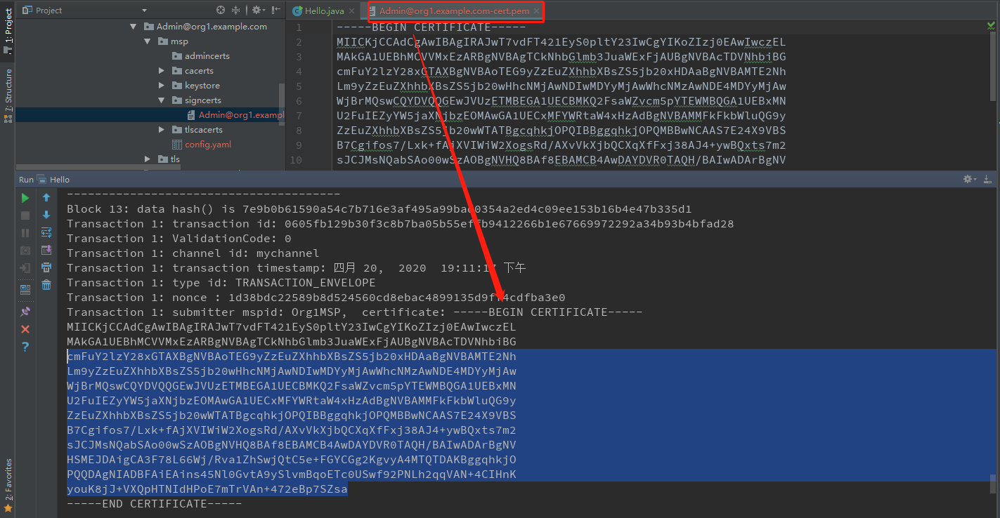

# 以SDK的方式从peer节点那里拿到链上数据

```java
public class Hello {

    // connection.json 里应该配置网络信息
    private static final Path NETWORK_CONFIG_PATH = Paths.get("src", "main", "resources", "connection.json");
    // 证书的位置
    private static final Path credentialPath = Paths.get("src", "main", "resources", "crypto-config",
            "peerOrganizations", "org1.example.com", "users", "Admin@org1.example.com", "msp");

    private static void queryKV(Network network) {
        try {
            // 拿到smart contract
            Contract contract = network.getContract("mycc");
            // 查询账本信息
            byte[] queryA = contract.evaluateTransaction("query", "a");
            System.out.println("A: " + new String(queryA, StandardCharsets.UTF_8));

            byte[] invokeTransfer = contract.createTransaction("invoke")
                    .setEndorsingPeers(network.getChannel().getPeers(EnumSet.of(Peer.PeerRole.ENDORSING_PEER)))
                    .submit("b", "a", "1");
            // 查询账本信息
            queryA = contract.evaluateTransaction("query", "a");
            System.out.println("A: " + new String(queryA, StandardCharsets.UTF_8));
        } catch (Exception e) {
            System.out.println("Query Error");
            e.printStackTrace();
        }
    }

    private static void queryLedger(Network network) {
        try {
            // 1.运行时，可以通过系统链码查询指定块的数据
//            Contract contract = network.getContract("qscc");
//            byte[] blockBytes = contract.evaluateTransaction("GetBlockByNumber", "mychannel", "0");
//            Block block = Block.parseFrom(blockBytes);
            // System.out.println(block.getHeader().getDataHash());

            // 2.初始化时，可以拿到所有的块
            Channel channel = network.getChannel();
            BlockchainInfo channelInfo = channel.queryBlockchainInfo();
            for (int current = 0; current < channelInfo.getHeight(); current++) {
                BlockInfo blockInfo = channel.queryBlockByNumber(current);
                long blockNumber = blockInfo.getBlockNumber();

                System.out.println("---------------------------------------");
                System.out.printf("Block %d: data hash() is %s \n", blockNumber, Hex.encodeHexString(blockInfo.getDataHash()));

                // 可以拿到块中的每笔交易
                int count = 0;
                for (BlockInfo.EnvelopeInfo env: blockInfo.getEnvelopeInfos()) {
                    count++;
                    System.out.printf("Transaction %d: transaction id: %s\n", count, env.getTransactionID());
                    System.out.printf("Transaction %d: ValidationCode: %s\n", count, env.getValidationCode());
                    System.out.printf("Transaction %d: channel id: %s\n", count, env.getChannelId());
                    System.out.printf("Transaction %d: transaction timestamp: %tB %<te,  %<tY  %<tT %<Tp\n", count, env.getTimestamp());
                    System.out.printf("Transaction %d: type id: %s\n", count, env.getType());
                    System.out.printf("Transaction %d: nonce : %s\n", count, Hex.encodeHexString(env.getNonce()));
                    System.out.printf("Transaction %d: submitter mspid: %s,  certificate: %s\n", count, env.getCreator().getMspid(), env.getCreator().getId());
                    if (env.getType() == BlockInfo.EnvelopeType.TRANSACTION_ENVELOPE) {
                        System.out.printf("Transaction %d: isValid: %b\n", count, env.isValid());
                    }
                }
            }
        } catch (Exception e) {
            System.out.println("Query Error");
            e.printStackTrace();
        }
    }

    public static void main(String[] args) throws Exception {

        X509Certificate certificate = readX509Certificate(credentialPath.resolve(Paths.get("signcerts", "Admin@org1.example.com-cert.pem")));
        PrivateKey privateKey = getPrivateKey(credentialPath.resolve(Paths.get("keystore", "priv_sk")));

        // 加载一个钱包，里面有接入网络所需要的identities
        Wallet wallet = Wallets.newInMemoryWallet();
        // Path walletDir = Paths.get("wallet");
        // Wallet wallet = Wallets.newFileSystemWallet(walletDir);
        wallet.put("user", Identities.newX509Identity("Org1MSP", certificate, privateKey));

        // 设置连接网络所需要的gateway connection配置信息
        Gateway.Builder builder = Gateway.createBuilder()
                .identity(wallet, "user")
                .networkConfig(NETWORK_CONFIG_PATH);

        // 创建Gateway连接
        try (Gateway gateway = builder.connect()){
            // 接入channel
            Network network = gateway.getNetwork("mychannel");

            // 通过链码拿去kv数据库中的数据
            // queryKV(network);

            // 通过系统链码查询账本中的数据
            queryLedger(network);

        } catch (Exception e) {
            System.out.println("Error!");
            e.printStackTrace();
        }
    }

    private static X509Certificate readX509Certificate(final Path certificatePath) throws IOException, CertificateException {
        try (Reader certificateReader = Files.newBufferedReader(certificatePath, StandardCharsets.UTF_8)) {
            return Identities.readX509Certificate(certificateReader);
        }
    }

    private static PrivateKey getPrivateKey(final Path privateKeyPath) throws IOException, InvalidKeyException {
        try (Reader privateKeyReader = Files.newBufferedReader(privateKeyPath, StandardCharsets.UTF_8)) {
            return Identities.readPrivateKey(privateKeyReader);
        }
    }
}

```


查询效果

