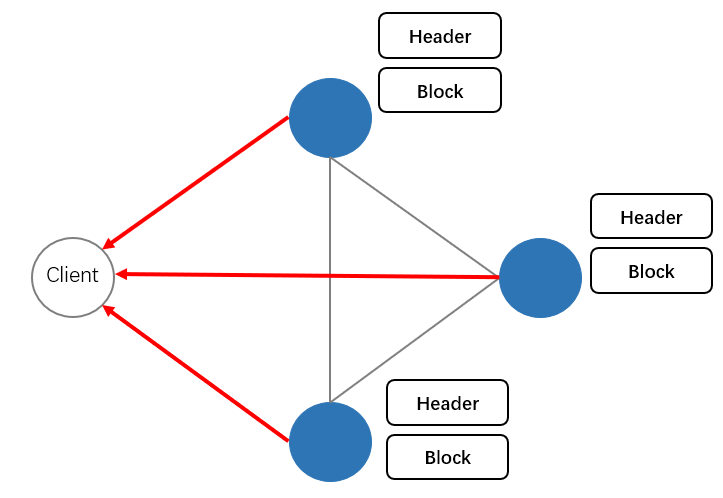
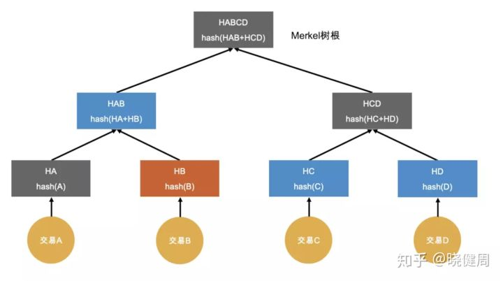

# 写在前面

## 国密项目：跨联盟需要解决的问题

问题：多个联盟之间，需要进行信息共享。

解决方法：当本联盟需要访问其他联盟中的信息时，只需要访问本联盟中其他联盟提供的“接口”就可以了。

“接口”的体现形式：

1. 在本联盟中设置访问其他链盟的客户端，通过其他联盟的客户端访问其他联盟中的信息。
2. 在本联盟中设置其他联盟的轻节点。（效仿以太坊）

不存储具体数据的原因：

1. Fabric属于联盟链，是一个permission chain，只有联盟中的管理者同意才能加入到链中。
   所以并不是每个想要访问其他联盟的节点都有权限访问，必须通过一个中间组件进行权限管理。
2. 一个联盟可能并不希望将自己的数据，放到其他联盟中。
3. 若一个联盟需要访问其他联盟中的数据，就维护其他联盟中的所有数据
   1. 成本太大，数据维护成本太高。
   2. 负载大，如果想要多个联盟之间互相访问数据就维护彼此的数据，即一个联盟维护其他所有联盟的数据，服务器的负载太大。
   3. 数据隐私性：这也是最为重要的问题，即一个联盟并不希望其他联盟保存自己的联盟中的数据。

因此，问题最终转化为：

* 在不存储其他联盟中的数据的情况下，即保护数据隐私性的情况下，如果快速且有效的查询其他联盟中的信息。

---

## 以太坊轻节点的方案分析：

在以太坊中为什么会有轻节点？

- 完整性需求：因为以太坊是公链，其中的节点可能会有traitor，数据的完整性有待考量。
- 数据存储性压力：并不是每一个节点都需要存储全部的区块头信息，否则压力太大

以太坊中轻节点机制如何实现？

- 对某个交易进行取hash，保证交易的完整性和不可篡改性。
- 对整个区块取哈希，保证整个区块的不可篡改性。
- Merkel tree机制：提高验证完整性的速度。

以太坊轻节点的实现收集的过程：

1. 轻节点客户端client，定期的向网络中的全节点发送回执区块头Header的请求。
2. 因此client保存了这个链的Header部分（数据量不大，目前以太坊的整条链的区块头部分规模在40M左右）。

以太坊轻节点实现查询历史交易以及验证的过程：

1. 轻节点根据交易id向全节点请求某笔历史交易记录txb
2. 全节点定位到具体的块以及在块中交易所处的位置
3. 全节点不需要把所有的交易的hash返回，只需返回ha,hcd,habcd即可。同时返回的还有txb的具体信息。
4. 轻节点收到了这些hash之后，在本地执行hash()操作，计算之后得到的Merkel root 和本地存储的区块头中的Merkel root进行对比。
5. 如果对比之后的结果相同，则为真。

在公链中以太坊的优点：

1. 在公链的情况下，可以只在存储区块头的情况下完成数据的校验工作，防止区块链网络中traitor的现象。

如果迁移到fabric中，可能具有的缺点缺点：

2. 是否存在时延长的缺点？因为轻节点仍然要向peer节点索求Merkel roof的过程，也是两个查询周期。
2. 维护数据头的成本：首先Fabric是一个联盟链，准许参加到链中可以完成在权限之内的所有操作。在权限的层面上限制了作恶节点的参与，在链上的数据都是在权限内的有效数据。
3. 是否有意义？以太坊是公链存在着验证数据的完整性的问题，Fabric中存在吗？

### 以太坊轻节点---验证：

轻节点的功能是：保存一个链中所有节点的区块头部分，不保存区块体部分。可以验证一笔交易是否存在于链上。

以太坊轻节点问题：

1. 当需要验证某一笔交易是否存在于链上时，以太坊的轻节点是怎么定位到具体的块的？
2. 为什么轻节点只保存区块头？他保存区块头有什么作用？
   答：首先保证自己手头上的区块头是真的，然后才能验证来自其他节点的数据的完整性，不然没有参考，不能判断交易的完整性。
3. 以太坊中，全节点是怎么根据请求的交易，定位到该交易处在块内的某一个点的？

Fabric轻节点的问题：

1. fabric的区块头只有三部分，如何利用这三部分进行轻节点的验证工作？[关于区块构造部分源码解析](./1-BlockStructure.md)
2. 从上面的源码分析我们可以看到，以太坊的区块头中包含了很多信息，但是fabric中区块头只有三部分，这三部分怎么利用？
3. 以太坊的全节点可以将一个merkel path上的hash值进行返回，如果在Fabric中做，这部分写在链码里的话怎么写？系统链码提供的支持足够吗？

### 以太坊轻节点---收集区块头：

Fabric中没有轻节点的概念，fabric中节点可以分为：client/peer/orderer。

1. 概念性问题：如果要在fabric中设计一个轻节点，这个轻节点的类型是不是更偏向于peer节点？
   - 答：这个“轻节点”更像是fabric中的peer节点
     轻节点中需要保存所有block的区块头部分，因此，在fabric中它的体现形式更像是peer节点的形式。因为peer节点在fabric中存储了区块信息。此外它表现为peer节点的形式好另外一个好处就是可以运行智能合约。

由于这个轻节点更像是一个peer节点，因此需要对fabric中peer节点进行源码上面的改造。

- 改造的最终目的是：**使fabric能够定期同步存储peer集群中所有区块的区块头数据。**

需要解决的问题，因为peer节点之间是通过Gossip协议进行同步区块信息的：

1. 首先，必要容易忽略的一个问题是，在gossip中，进行节点之间的同步通信工作是可以通过选举完成的。选举成功之后成为主节点，负责与orderer节点进行通信，从orderer哪里拿到区块之后再分发给其他的peer。因为轻节点只需要同步区块头，不需要承担这么重要的任务，所以需要对轻节点的gossip的选举部分进行改动，不要让他选举为负责与orderer进行沟通的主节点。
   答：可以通过设置gossip旁观者解决这个问题。
2. 需要在peer节点的Gossip负责监听的端口开始追踪工作。
3. peer节点监听到有区块进来后，在对区块进行存储时，需要对他的处理区块的代码进行改动，只存储区块头。

### 以太坊“轻节点”总结：

1. 以太坊的“轻节点”是在公链的区块链网络的工作状态下，验证交易的真实性的一个节点。之所以称之为“轻节点”，是因为他没有存储区块的交易信息。
2. 通过下面这个方案，可以在不存储区块的前提下，完成跨联盟的查询需求。而且端到端时延尽可能逼近与两次端到端时延。

---

## 其他联盟客户端方案分析：

具体过程：

1. 客户端向联盟A-peer发送了一个跨联盟查询证书请求。

2. 联盟A-peer接受到了查询请求，部署在其上的链码可以识别出这是一个跨联盟查询请求。A-peer从而放弃在本联盟的账本上查询数据，通过链码与middle client建立一个grpc连接，转而middle client完成一个跨联盟查询的任务。

   注：middle client是部署在server a一个客户端容器。middle对联盟A中的所有的peer暴露出一个查询端口，用于接收联盟A中peer节点发送过来的跨联盟查询联盟B的请求。

3. 接受到请求之后，判断请求是否合法合规。（安全性和隐私性的考虑，先放到后面后期实现）

   * middle将跨联盟查询请求进行相应的转化，向联盟B发送查询请求。
   * middle在联盟B中的查询的过程就属于正常的查询过程了。

4. middle得到反馈的结果，发送给联盟A中的peer节点。

5. 联盟A的peer节点得到从middle反馈回来的数据后，反馈给客户。

优点：

1. 信息完整性：在授权之后，可以得到某个证照的具体信息，信息完整度高。
2. 性能：只要并发性处理得当，可以提供尽可能小的时延。
3. 完善的权限控制：不存储另外一个联盟的数据，保护了信息的隐私性。

面临的难点：

1. 在高并发的情况下的并发量的问题。
2. middle client容器的镜像制作问题。
3. grpc：容器之间的数据通信问题。

# 蚂蚁金服区块链跨链研究

---

# 查询---Fabric交易的生命周期

在这里贴一下贴一下交易的生命周期，以便自己有一个宏观的认识

app提交交易流程：

1. Hyperledger Fabric SDK 通过 APIs 使应用程序能够连接到 peers。
   application生成交易提案proposal，其中包含本次交易要调用的合约标识、合约方法和参数信息以及客户端签名等。
2. 在交易提案能够被网络所接受之前，app必须得到背书策略所指定的peers的背书。peer使用proposal来调用 chaincode，从而生成交易的proposal response。
   1. peer 根据 proposal 的信息，调用用户上传的链码
   2. 链码处理请求，将请求转化位对账本的读集合与写集合。
   3. peer 对读集合和写集合进行签名，并将proposal response 返回给app SDK。
3. application接收到了一定数量经过背书后的proposal responses，并将读集合与写集合和不同节点的签名拼接在一起，组成envelope（在这里envelope才是一个真正的tx）。
4. application提交envelope到order节点后，sdk并监听peer节点的块事件。
   1. 在orderer集群中envelope会被排序，当orderer收集到足够多的envelope后，生成新的区块。
   2. orderer将区块广播到peer集群中的分布式账本中。
      注：不是每个 Peer 节点都需要连接到一个排序节点，只需要一个peer主节点连接到order就可以了，然后Peer中的主节点可以使用 gossip 协议将区块关联到其他节点。（gossip的另外一个应用就是组织间的peer的相互通信）
   3. 每个peer节点将独立地以确定的方式验证区块，以确保账本保持一致。具体来说，通道中每个peer节点都将验证区块中的每个交易，以确保得到了所需组织的节点背书，也就是peer节点的背书和背书策略相匹配，并且不会因最初认可该事务时可能正在运行的其他最近提交的事务而失效。无效的交易仍然保留在排序节点创建的区块中，但是节点将它们标记为无效，并且不更新账本的状态。
5. 在peer集群收到区块并进行验证之后，peer向sdk发送新收到的区块和验证结果。
6. sdk根据事件的验证结果，判断交易是否成功上链。

## 现阶段需要解决的问题：

需要弄清fabric中，查询/某一笔交易的过程。

1. fabric中可以直接查询一个历史交易吗？
   答：fabric是可以通过txid查询到一个交易的具体信息。具体是通过调用部署在peer节点上的系统链码qscc中的getTransactionByID()方法实现
2. fabric查询一个对象的信息是从key-value数据库中得到的吗？[读取kv数据库的源码分析](./2-ReadKV.md)
   答：是的，一般是使用couchdb的语法，从couchdb的数据库中读取到一个对象的最终状态。

