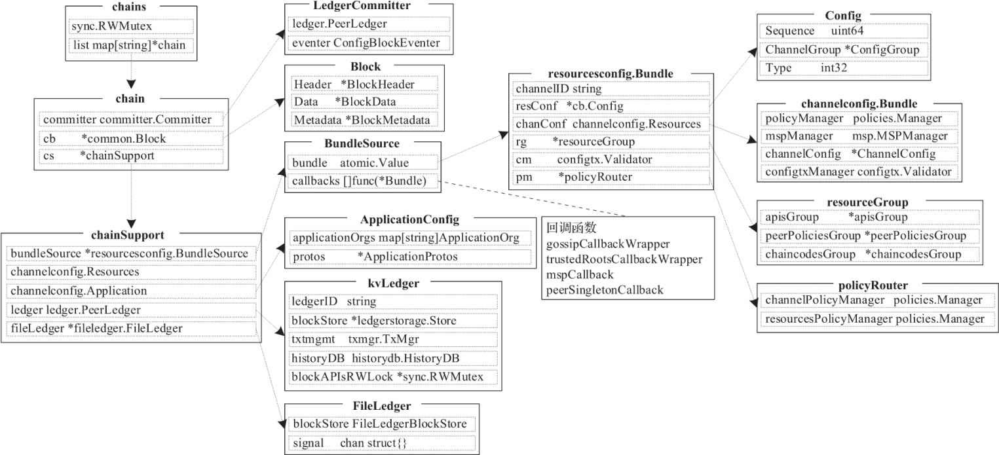

# 0 初始化通道上的Gossip 服务模块

# 1 初始化启动参数

Peer节点通过CSCC系统链码加入指定的应用通道，调用createChannel()方法初始化当前通道上的Gossip服务模块包括

- GossipChannel消息通道
- 隐私数据处理句柄对象
- 数据请求服务deliveryService模块
- 选举模块等

## 1.入口

### 1.serve()

在peer节点启动执行peer node start时，进行的peerInstance初始化工作

internal\peer\node\start.go

```go
func serve(args []string) error {
    ...
	// this brings up all the channels
	peerInstance.Initialize(
		func(cid string) {
			// initialize the metadata for this channel.
			// This call will pre-populate chaincode information for this
			// channel but it won't fire any updates to its listeners
			lifecycleCache.InitializeMetadata(cid)

			// initialize the legacyMetadataManager for this channel.
			// This call will pre-populate chaincode information from
			// the legacy lifecycle for this channel; it will also fire
			// the listener, which will cascade to metadataManager
			// and eventually to gossip to pre-populate data structures.
			// this is expected to disappear with FAB-15061
			sub, err := legacyMetadataManager.NewChannelSubscription(cid, cclifecycle.QueryCreatorFunc(func() (cclifecycle.Query, error) {
				return peerInstance.GetLedger(cid).NewQueryExecutor()
			}))
			if err != nil {
				logger.Panicf("Failed subscribing to chaincode lifecycle updates")
			}

			// register this channel's legacyMetadataManager (sub) to get ledger updates
			// this is expected to disappear with FAB-15061
			cceventmgmt.GetMgr().Register(cid, sub)
		},
		peerServer,
		plugin.MapBasedMapper(validationPluginsByName),
		lifecycleValidatorCommitter,
		lsccInst,
		lifecycleValidatorCommitter,
		coreConfig.ValidatorPoolSize,
	)
    ...
}
```

### 2.Initialize

core\peer\peer.go

```go
// Initialize sets up any channels that the peer has from the persistence. This
// function should be called at the start up when the ledger and gossip ready
func (p *Peer) Initialize(
	init func(string),
	server *comm.GRPCServer,
	pm plugin.Mapper,
	deployedCCInfoProvider ledger.DeployedChaincodeInfoProvider,
	legacyLifecycleValidation plugindispatcher.LifecycleResources,
	newLifecycleValidation plugindispatcher.CollectionAndLifecycleResources,
	nWorkers int,
) {
	// TODO: exported dep fields or constructor
	p.server = server
	p.validationWorkersSemaphore = semaphore.New(nWorkers)
	p.pluginMapper = pm
	p.channelInitializer = init

	ledgerIds, err := p.LedgerMgr.GetLedgerIDs()
	if err != nil {
		panic(fmt.Errorf("error in initializing ledgermgmt: %s", err))
	}

	for _, cid := range ledgerIds {
		peerLogger.Infof("Loading chain %s", cid)
		ledger, err := p.LedgerMgr.OpenLedger(cid)
		if err != nil {
			peerLogger.Errorf("Failed to load ledger %s(%+v)", cid, err)
			peerLogger.Debugf("Error while loading ledger %s with message %s. We continue to the next ledger rather than abort.", cid, err)
			continue
		}
		// Create a chain if we get a valid ledger with config block
		err = p.createChannel(cid, ledger, deployedCCInfoProvider, legacyLifecycleValidation, newLifecycleValidation)
		if err != nil {
			peerLogger.Errorf("Failed to load chain %s(%s)", cid, err)
			peerLogger.Debugf("Error reloading chain %s with message %s. We continue to the next chain rather than abort.", cid, err)
			continue
		}

		p.initChannel(cid)
	}
}

```

以下时Fabric1.0的Peer节点上链结构字典chains类型示意图



## 2.createChannel

core\peer\peer.go

```go
// createChannel creates a new channel object and insert it into the channels slice.
func (p *Peer) createChannel(
	cid string,
	l ledger.PeerLedger,
	deployedCCInfoProvider ledger.DeployedChaincodeInfoProvider,
	legacyLifecycleValidation plugindispatcher.LifecycleResources,
	newLifecycleValidation plugindispatcher.CollectionAndLifecycleResources,
) error {
    // 1.读取账本中保存的通道配置chanConf，即与channelConfigKey对应的值
	chanConf, err := retrievePersistedChannelConfig(l)
	// 2.创建新的通道配置实体对象Bundle结构
	bundle, err := channelconfig.NewBundle(cid, chanConf, p.CryptoProvider)
	// 3.检查通道配置对象是否支持指定的功能特性
	capabilitiesSupportedOrPanic(bundle)
	// 4.检查通道配置对象上策略管理器的规范性
	channelconfig.LogSanityChecks(bundle)
	// 5.
	gossipEventer := p.GossipService.NewConfigEventer()
	// 6.回调函数gossipCallbackWrapper()：根据当前新链的通道配置创建与更新对应的GossipChannel通道对象，用于过滤消息并控制其在通道内的传播。
	gossipCallbackWrapper := func(bundle *channelconfig.Bundle) {
		// Application应用通道配置
        ac, ok := bundle.ApplicationConfig()
        // 更新当前通道链结构的通道配置。
		gossipEventer.ProcessConfigUpdate(&gossipSupport{
			Validator:   bundle.ConfigtxValidator(), 	// 交易验证器
			Application: ac, 							// Application应用通道配置
			Channel:     bundle.ChannelConfig(), 		// 通道配置
		})
		p.GossipService.SuspectPeers(func(identity api.PeerIdentityType) bool {
			return true
		})
	}
	// 6.回调函数trustedRootsCallbackWrapper()：更新当前节点上默认的gRPC服务器中配置的信任根CA证书列表。
	trustedRootsCallbackWrapper := func(bundle *channelconfig.Bundle) {
		p.updateTrustedRoots(bundle)
	}
	// 6.回调函数mspCallback：设置全局变量mspMap字典中当前新链上的MSP组件管理器对象，将其设置为当前新链通道配置中的MSP组件管理器，以用于管理该通道配置上所有的MSP组件集合。
	mspCallback := func(bundle *channelconfig.Bundle) {
		mspmgmt.XXXSetMSPManager(cid, bundle.MSPManager())
	}

	osLogger := flogging.MustGetLogger("peer.orderers")
	namedOSLogger := osLogger.With("channel", cid)
    ordererSource := orderers.NewConnectionSource(namedOSLogger, p.OrdererEndpointOverrides)
	// 6.回调函数
	ordererSourceCallback := func(bundle *channelconfig.Bundle) {
		globalAddresses := bundle.ChannelConfig().OrdererAddresses()
		orgAddresses := map[string]orderers.OrdererOrg{}
		if ordererConfig, ok := bundle.OrdererConfig(); ok {
			for orgName, org := range ordererConfig.Organizations() {
				certs := [][]byte{}
				for _, root := range org.MSP().GetTLSRootCerts() {
					certs = append(certs, root)
				}

				for _, intermediate := range org.MSP().GetTLSIntermediateCerts() {
					certs = append(certs, intermediate)
				}

				orgAddresses[orgName] = orderers.OrdererOrg{
					Addresses: org.Endpoints(),
					RootCerts: certs,
				}
			}
		}
		ordererSource.Update(globalAddresses, orgAddresses)
	}
	
    // 7.创建channel
	channel := &Channel{
		ledger:         l,
		resources:      bundle,
		cryptoProvider: p.CryptoProvider,
	}
	
    // 8.更新channel配置：构造并设置新通道资源配置的BundleSource对象
	channel.bundleSource = channelconfig.NewBundleSource(
		bundle,							// 通道资源配置实体Bundle对象
		ordererSourceCallback,			// 回调函数
		gossipCallbackWrapper,			// 回调函数
		trustedRootsCallbackWrapper,	// 回调函数
		mspCallback,					// 回调函数
		channel.bundleUpdate,			// 
	)
	// 9.创建提交器
	committer := committer.NewLedgerCommitter(l)
    // 10.创建Committer模块的交易验证器，用于执行VSCC以验证交易背书策略的有效性
	validator := &txvalidator.ValidationRouter{
		...
	}

	// 11.创建指定通道上的transient隐私数据存储对象），用于临时缓存Endorser背书节点通过Gossip消息协议分发的隐私数据
	store, err := p.openStore(bundle.ConfigtxValidator().ChannelID())
	channel.store = store
	
    // 12.创建隐私数据集合存储对象，用于从通道账本中获取指定链码的隐私数据集合配置信息，封装了隐私数据的访问权限策略。
	simpleCollectionStore := privdata.NewSimpleCollectionStore(l, deployedCCInfoProvider)
    
    // 13.初始化指定通道上的Gossip服务模块
	// 若是Leader主节点，则从Orderer节点获取通道账本区块，否则，从组织内其他节点接收数据
	p.GossipService.InitializeChannel(bundle.ConfigtxValidator().ChannelID(), ordererSource, store, gossipservice.Support{
		Validator:       validator,			// 交易验证器
		Committer:       committer,			// 账本提交器
		CollectionStore: simpleCollectionStore,		// 隐私数据集合存储对象
		IdDeserializeFactory: gossipprivdata.IdentityDeserializerFactoryFunc(func(chainID string) msp.IdentityDeserializer {
			return mspmgmt.GetManagerForChain(chainID)
		}),
		CapabilityProvider: channel,
	})

	p.mutex.Lock()
	defer p.mutex.Unlock()
    // 14.构造新链结构并插入Peer节点上的链结构字典
	if p.channels == nil {
		p.channels = map[string]*Channel{}
	}
	p.channels[cid] = channel

	return nil
}
```

# 2 初始化Gossip服务模块

在上面初始化通道参数结束之后，则开始初始化指定通道上Gossip服务器实例的服务模块或组件

## 1.p.GossipService.InitializeChannel

gossip\service\gossip_service.go

```go
// InitializeChannel allocates the state provider and should be invoked once per channel per execution
func (g *GossipService) InitializeChannel(channelID string, ordererSource *orderers.ConnectionSource, store *transientstore.Store, support Support) {
	g.lock.Lock()
	defer g.lock.Unlock()
	
    // 1.Initialize new state provider for given committer
	servicesAdapter := &state.ServicesMediator{GossipAdapter: g, MCSAdapter: g.mcs}

	// 2.Initialize private data fetcher
	dataRetriever := gossipprivdata.NewDataRetriever(store, support.Committer)
	// 3.
    collectionAccessFactory := gossipprivdata.NewCollectionAccessFactory(support.IdDeserializeFactory)
    // 4.创建Fetcher组件，用于请求获取缺失的隐私数据
    // Fetcher组件在创建时还会启动goroutine，监听PrivateReq类型隐私数据请求消息与PrivateRes类型隐私数据响应消息
	fetcher := gossipprivdata.NewPuller(g.metrics.PrivdataMetrics, support.CollectionStore, g.gossipSvc, dataRetriever,
		collectionAccessFactory, channelID, g.serviceConfig.BtlPullMargin)
	
    
	coordinatorConfig := gossipprivdata.CoordinatorConfig{
		TransientBlockRetention:        g.serviceConfig.TransientstoreMaxBlockRetention,
		PullRetryThreshold:             g.serviceConfig.PvtDataPullRetryThreshold,
		SkipPullingInvalidTransactions: g.serviceConfig.SkipPullingInvalidTransactionsDuringCommit,
	}
	selfSignedData := g.createSelfSignedData()
	mspID := string(g.secAdv.OrgByPeerIdentity(selfSignedData.Identity))
	// 5.创建coordinator模块
    // 将coordinator模块注册到Gossip服务器实例指定通道上的privateHandler隐私数据处理句柄上与state模块上，用于管理本地通道账本上的区块数据与隐私数据，执行验证交易与提交账本、获取本地隐私数据、拉取缺失隐私数据等
    coordinator := gossipprivdata.NewCoordinator(mspID, gossipprivdata.Support{
		ChainID:            channelID,
		CollectionStore:    support.CollectionStore,
		Validator:          support.Validator,
		Committer:          support.Committer,
		Fetcher:            fetcher,
		CapabilityProvider: support.CapabilityProvider,
	}, store, selfSignedData, g.metrics.PrivdataMetrics, coordinatorConfig,
		support.IdDeserializeFactory)

    // 6.
	var reconciler gossipprivdata.PvtDataReconciler
	if g.privdataConfig.ReconciliationEnabled {
		reconciler = gossipprivdata.NewReconciler(channelID, g.metrics.PrivdataMetrics,
			support.Committer, fetcher, g.privdataConfig)
	} else {
		reconciler = &gossipprivdata.NoOpReconciler{}
	}

	pushAckTimeout := g.serviceConfig.PvtDataPushAckTimeout
    // 7.创建隐私数据处理句柄
    // 该字典可保存指定通道上的隐私数据处理句柄（privateHandler类型），提供给Gossip服务实例在DistributePrivate-Data()函数中分发与保存隐私数据。
    // 其调用该对象上的distributor.Distribute()方法分发隐私数据，利用该对象上的coordinator.StorePvtData()方法保存隐私数据，例如Endorser节点调用distributePrivateData()→gossipServiceImpl.DistributePrivateData()函数。
    // 其中，distributePrivateData()函数是在节点启动时（peer node start）设置的，即privDataDist()函数。
	g.privateHandlers[channelID] = privateHandler{
		support:     support,
		coordinator: coordinator,
		distributor: gossipprivdata.NewDistributor(channelID, g, collectionAccessFactory, g.metrics.PrivdataMetrics, pushAckTimeout),
		reconciler:  reconciler,
	}
	g.privateHandlers[channelID].reconciler.Start()

	blockingMode := !g.serviceConfig.NonBlockingCommitMode
	stateConfig := state.GlobalConfig()
    // 8.创建并注册state模块
    // 该字典可保存指定通道上的state模块对象（GossipStateProviderImpl类型）。
    // 这里的状态（state）泛指数据，包括区块数据与隐私数据。实际上，state模块负责处理DataMsg类型数据消息、StateRequest类型远程状态请求消息、StateResponse类型远程状态响应消息、pvtDataMsg类型隐私数据等，启用goroutine等程序处理对应类型的消息。
    // 同时，state模块封装了coordinator对象作为ledger属性字段，负责验证交易与提交账本。
	g.chains[channelID] = state.NewGossipStateProvider(
		flogging.MustGetLogger(util.StateLogger),
		channelID,
		servicesAdapter,
		coordinator,
		g.metrics.StateMetrics,
		blockingMode,
		stateConfig)
   
    // 9.创建并注册Deliver服务实例
    // 该字典可保存指定通道上的Deliver服务实例。其中，Leader主节点会调用StartDeliverForChannel()方法，启动Deliver服务实例，并创建区块分发服务的broadcastClient结构客户端。该客户端定义了连接到Orderer节点的参数及相关回调函数。接着，调用blocksprovider.New-BlocksProvider()方法，创建区块提供者BlocksProvider，并执行DeliverBlocks()方法，主动向Orderer节点请求获取指定范围内的区块数据，建立消息处理循环，依次处理每次接收的1个区块数据，解析并添加到本地的消息负载缓冲区中，等待提交账本。同时，将该数据重新封装为DataMsg类型的数据消息（GossipMessage_CHAN_AND_ORG消息标签，不包含隐私数据），最后调用Gossip()方法对消息进行签名，并将该消息添加到指定通道的GossipChannel通道对象上，包括blocksPuller模块与blockMsgStore消息存储对象，再交由emitter模块转发给其他节点。
	if g.deliveryService[channelID] == nil {
		g.deliveryService[channelID] = g.deliveryFactory.Service(g, ordererSource, g.mcs, g.serviceConfig.OrgLeader)
	}
	// Delivery service might be nil only if it was not able to get connected to the ordering service
	if g.deliveryService[channelID] != nil {
		// 注：参数peer.gossip.useLeaderElection与peer.gossip.orgLeader是互斥的两个配置项
		leaderElection := g.serviceConfig.UseLeaderElection
		isStaticOrgLeader := g.serviceConfig.OrgLeader
		// 不可以同时为true
		if leaderElection && isStaticOrgLeader {
		}

		if leaderElection {
			// 启用Leader主节点选举模块
            // 该字典可保存Peer节点上指定通道的Leader主节点选举服务实例。
            // Leader主节点选举成功后执行g.onStatusChangeFactory()回调函数，启动该通道的deliveryService服务模块，即Deliver服务实例，并从Orderer节点请求获取关联通道的账本数据。
            // 当Gossip服务实例停止时，同样会检查停止election选举模块。
			g.leaderElection[channelID] = g.newLeaderElectionComponent(channelID, g.onStatusChangeFactory(channelID,
				support.Committer), g.metrics.ElectionMetrics)
		} else if isStaticOrgLeader {
			// 静态指定Leader主节点
			g.deliveryService[channelID].StartDeliverForChannel(channelID, support.Committer, func() {})
		} else {
			logger.Debug("This peer is not configured to connect to ordering service for blocks delivery, channel", channelID)
		}
	} else {
		logger.Warning("Delivery client is down won't be able to pull blocks for chain", channelID)
	}

}

```

Gossip服务器实例初始化通道时启动的服务程序:

1. Fetcher组件
   - go p.listen()：监听隐私数据请求消息与隐私数据响应消息
2. State模块
   - go s.listen()：监听gossipChan通道与commChan通道的消息
   - go s.deliverPayloads()：从消息负载缓冲区取出消息，并提交账本
   - go s.antiEntropy()：反熵算法用于请求拉取缺失数据
   - go s.processStateRequests()：处理远程状态请求信息