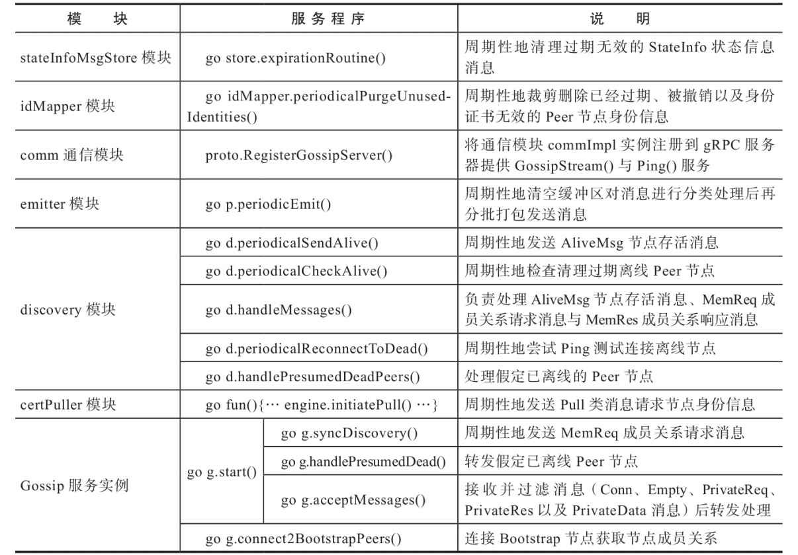

# 0 "GossipService 服务器"初始化

fabric gossip主要是为了peer节点之间数据传播使用的，所以初始化是和peer节点一起初始化的。

## 1 GossipService服务器初始化---入口

peer节点初始化入口：fabric\internal\peer\node\start.go---serve()

```go
func serve(args []string) error {
	
    ...

	gossipService, err := initGossipService(
		...
	)
	if err != nil {
		return errors.WithMessage(err, "failed to initialize gossip service")
	}
	defer gossipService.Stop()
    
    ...
    
}
```

## 2 创建GossipService服务器

0. GossipService服务器的组成模块

   gossip\service\gossip_service.go

GossipService的具体结构为：

```go
type GossipService struct {
	gossipSvc
	privateHandlers map[string]privateHandler
	chains          map[string]state.GossipStateProvider
	leaderElection  map[string]election.LeaderElectionService
	deliveryService map[string]deliverservice.DeliverService
	deliveryFactory DeliveryServiceFactory
	lock            sync.RWMutex
	mcs             api.MessageCryptoService
	peerIdentity    []byte
	secAdv          api.SecurityAdvisor
	metrics         *gossipmetrics.GossipMetrics
	serviceConfig   *ServiceConfig
	privdataConfig  *gossipprivdata.PrivdataConfig
}
```

1. initGossipService

   internal\peer\node\start.go

```go
// initGossipService will initialize the gossip service by:
// 1. Enable TLS if configured;
// 2. Init the message crypto service;
// 3. Init the security advisor;
// 4. Init gossip related struct.
func initGossipService(...) (*gossipservice.GossipService, error) {
    
    ...
    
    其中initGossipService()的具体步骤为：
        1. 开启tls
        2. 初始化消息加密服务
        3. 初始化security advisor
        4. 初始化gossip相关的数据结构
    
	return gossipservice.New(
		...
	)
}
```

2. 初始化GossipService服务器：

   gossip\service\gossip_service.go

```go
// New creates the gossip service.
func New(
	...
) (*GossipService, error) {
	
	// 1.实例化一个gossip服务
	gossipComponent := gossip.New(
		gossipConfig,
		s,
		secAdv,
		mcs,
		serializedIdentity,
		secureDialOpts,
		gossipMetrics,
	)

    // 2.将gossip服务和其他模块服务结合在一起组成一个gossip服务器，然后完成gossip服务器的初始化
	return &GossipService{
		gossipSvc:       gossipComponent,
		mcs:             mcs,
		privateHandlers: make(map[string]privateHandler),
		chains:          make(map[string]state.GossipStateProvider),
		leaderElection:  make(map[string]election.LeaderElectionService),
		deliveryService: make(map[string]deliverservice.DeliverService),
		deliveryFactory: &deliveryFactoryImpl{
			signer:               peerIdentity,
			credentialSupport:    credSupport,
			deliverGRPCClient:    deliverGRPCClient,
			deliverServiceConfig: deliverServiceConfig,
		},
		peerIdentity:   serializedIdentity,
		secAdv:         secAdv,
		metrics:        gossipMetrics,
		serviceConfig:  serviceConfig,
		privdataConfig: privdataConfig,
	}, nil
}
```

### 2.1 实例化Gossip服务

这里谈一下GossipService服务器和Gossip服务的区别：

- GossipSevice服务器除了提供Gossip服务，还提供其他模块的服务
  - 比如消息加密、收发消息、主节点选取、私有数据服务、权限表等服务
- 也就是说Gossip服务是GossipService服务器的组成的一部分

#### 0 Gossip服务的组织结构

```go
type Node struct {
	selfIdentity          api.PeerIdentityType
	includeIdentityPeriod time.Time
	certStore             *certStore
	idMapper              identity.Mapper
	presumedDead          chan common.PKIidType
	disc                  discovery.Discovery
	comm                  comm.Comm
	selfOrg               api.OrgIdentityType
	*comm.ChannelDeMultiplexer
	logger            util.Logger
	stopSignal        *sync.WaitGroup
	conf              *Config
	toDieChan         chan struct{}
	stopFlag          int32
	emitter           batchingEmitter
	discAdapter       *discoveryAdapter
	secAdvisor        api.SecurityAdvisor
	chanState         *channelState
	disSecAdap        *discoverySecurityAdapter
	mcs               api.MessageCryptoService
	stateInfoMsgStore msgstore.MessageStore
	certPuller        pull.Mediator
	gossipMetrics     *metrics.GossipMetrics
}
```

#### 1 Gossip服务初始化过程

```go
// New creates a gossip instance attached to a gRPC server
func New(conf *Config, s *grpc.Server, sa api.SecurityAdvisor,
	mcs api.MessageCryptoService, selfIdentity api.PeerIdentityType,
	secureDialOpts api.PeerSecureDialOpts, gossipMetrics *metrics.GossipMetrics) *Node {
	// 实例化一个Gossip Node
	g := &Node{
		...
	}
    
    // 1.创建一个MessageStore
    // MessageStore：Gossip服务实例的消息存储模块，主要提供的服务是把一个消息添加到Gossip Node的内部缓冲区中，然后还可以检测消息的有效性，如果消息无效，就把消息从缓冲区中移除掉
	g.stateInfoMsgStore = g.newStateInfoMsgStore()

    // 2.创建一个identityMapperImpl，它实现的是Mapper接口
    // identityMapperImpl节点身份管理器，可以完成：peer的pkiID到他的identity certificate 的映射，也就是负责维护pkiID2Cert字典，保存节点的PKI-ID及其节点身份信息
	g.idMapper = identity.NewIdentityMapper(mcs, selfIdentity, func(pkiID common.PKIidType, identity api.PeerIdentityType) {
		g.comm.CloseConn(&comm.RemotePeer{PKIID: pkiID})
		g.certPuller.Remove(string(pkiID))
	}, sa)

    // 创建CommConfig
    // CommConfig的主要包含的是通信时的一些配置参数
	commConfig := comm.CommConfig{
		DialTimeout:  conf.DialTimeout,
		ConnTimeout:  conf.ConnTimeout,
		RecvBuffSize: conf.RecvBuffSize,
		SendBuffSize: conf.SendBuffSize,
	}
    // 3.创建Comm通信实例
    // Comm提供的主要的功能就是：向其他模块提供通信接口以使该peer可以和其他的peer完成通信工作
	g.comm, err = comm.NewCommInstance(s, conf.TLSCerts, g.idMapper, selfIdentity, secureDialOpts, sa,
		gossipMetrics.CommMetrics, commConfig)

    // 4.创建一个ChannelState实例
    // ChannelState提供的主要服务是：该peer的gossip node的通道消息处理模块。
    // 管理了该Peer节点所有的已连接的GossipChannel通道列表channels
    // 其中，GossipChannel通道对象可分别提供blockMsgStore、stateInfoMsgStore与leaderMsgStore等消息存储对象，用于处理通道内传播的消息，包括DataMsg类型数据消息、状态类消息、LeadershipMsg类型主节点选举消息等。
	g.chanState = newChannelState(g)
    
    // 5.创建一个batchingEmitter实例
    // batchingEmitter批量消息发送模块：为其他模块提供发送Gossip消息的接口。
    // 主要用于在gossip node进行 push或者forwarding时，将添加到batchingEmitter中的消息定期的分批次的发送出去。或者当到达batchingEmitter的容量上限时也会触发发送机制。
	g.emitter = newBatchingEmitter(conf.PropagateIterations,
		conf.MaxPropagationBurstSize, conf.MaxPropagationBurstLatency,
		g.sendGossipBatch)

    // 6.创建一个discoveryAdapter实例
    // discoveryAdapter：用于为discovery模块接收、过滤与转发消息。
    // 该适配器模块封装了comm通信模块用于底层消息的通信，并定义了discovery模块的gossipFunc()分发数据函数和forwardFunc()转发数据函数，它们都将消息添加到emitter模块中请求发送。
    // 其中，forwardFunc()函数还定义了消息过滤器用于过滤节点。
    // 同时，discAdapter适配器模块还提供了incChan通道，用于接收AliveMsg类型、MemReq类型与MemRes类型消息。
	g.discAdapter = g.newDiscoveryAdapter()
    
    // 7.创建一个discoverySecurityAdapter实例
    // 可提供身份管理、消息加密、签名与验签等安全服务。
    // 封装了Security-Advisor安全辅助组件、idMapper模块、MessageCryptoService消息加密服务组件、通信模块、日志模块、Peer节点身份证书信息等。
	g.disSecAdap = g.newDiscoverySecurityAdapter()

	discoveryConfig := discovery.DiscoveryConfig{
		AliveTimeInterval:            conf.AliveTimeInterval,
		AliveExpirationTimeout:       conf.AliveExpirationTimeout,
		AliveExpirationCheckInterval: conf.AliveExpirationCheckInterval,
		ReconnectInterval:            conf.ReconnectInterval,
		BootstrapPeers:               conf.BootstrapPeers,
	}
    // 8.创建Discovery实例
    // Discovery：可以发现和更新一些存活peer成员，也可以和远端的peer节点建立连接。
	g.disc = discovery.NewDiscoveryService(g.selfNetworkMember(), g.discAdapter, g.disSecAdap, g.disclosurePolicy,
		discoveryConfig)
	
    // 9.创建CertStorePuller实例
    // CertStorePuller：实现了Mediator
    // Mediator可以周期性地发送Pull类节点身份消息，请求拉取PeerIdentity类型节点身份消息，并通过自身的engine模块管理存储消息摘要（节点的PKI-ID）
    // 具体处理4类底层交互的Pull类消息（Hello消息、DataDig摘要消息、DataReq摘要请求消息与DataUpdate摘要更新消息）。
	g.certPuller = g.createCertStorePuller()
    
    // 10.创建certStore
    // 通过certPuller模块管理与存储PeerIdentity类型节点身份消息，预处理Pull类节点身份消息，并交由certPuller模块具体处理。
    // 当交互处理完DataReq摘要请求消息时，执行RegisterMsgHook()回调函数，将请求节点的信息更新到pkiID2-Cert字典中。
	g.certStore = newCertStore(g.certPuller, g.idMapper, selfIdentity, mcs)

	if g.conf.ExternalEndpoint == "" {
		g.logger.Warning("External endpoint is empty, peer will not be accessible outside of its organization")
	}
	// Adding delta for handlePresumedDead and
	// acceptMessages goRoutines to block on Wait
	g.stopSignal.Add(2)
    
    // 11.节点开始工作
	go g.start()
    // 10.连接其他的peer节点的Gossip node服务
    // 详细的连接其他peer节点的过程在另外一个源码分析中
	go g.connect2BootstrapPeers()

	return g
}
```

#### 2 初始化Gossip node 过程中启动服务

在启动GossipService服务器的过程中，同时启动了各项服务



