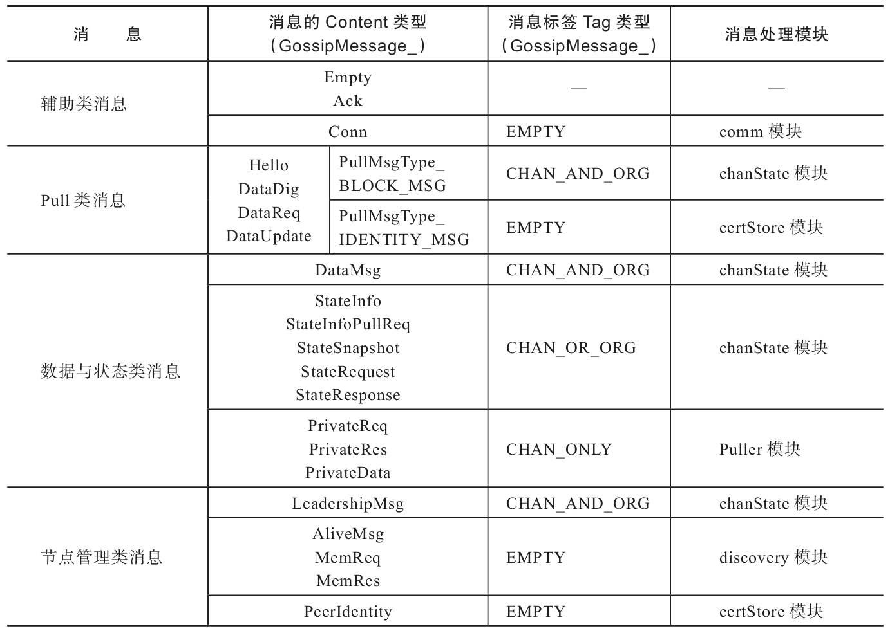

# Gossip消息通信与处理机制

## Gossip消息概述

GossipMessage消息的原型定义在protos/gossip/message.proto及vendor\github.com\hyperledger\fabric-protos-go\gossip\message.pb.go文件中，添加签名后被封装为SignedGossipMessage类型消息再发送。

Gossip消息的消息内容类型与消息标签类型列表，**为了简洁省去Gossip-Message_字符串**：

### 1.辅助类消息

辅助类消息：

- 用于提供信息以辅助其他模块
- 不会负责传播具体的数据消息、隐私数据、状态信息等数据，具体说明如下。

主要包括：

1. Empty：空消息。

   例如，Peer节点发送Ping消息用于测试远程节点是否连通。

2. Conn：用于Peer节点之间建立通信连接。

   例如，Handshake()方法建立双方节点握手协议时，会将当前节点的身份证书哈希值、消息签名等封装为Conn类型连接消息，发送给对方以验证节点身份的真实性。

3. Ack：应答消息，用于回应处理结果。

   例如，privateDataMessage()方法处理隐私数据消息后回复结果状态消息。

### 2.Pull类消息

Gossip消息模块上的Pull算法用于Peer节点向其他节点主动拉取所需要的数据。

Pull算法（gossip\gossip\algo\pull.go）的步骤实现如下：

1. A发送Hello消息及Nonce（消息随机数）给B。
2. B处理Hello消息后，返回DataDigest摘要消息及Nonce给A。
3. A校验数据和Nonce，将B作为待发送节点，并封装请求的数据项为DataRequest摘要请求消息，再发送该消息及Nonce到B。
4. B处理消息后，返回请求数据的DataUpdate摘要更新消息及Nonce给A。

注：Nonce是通信安全中使用一次即废弃的整数。

Pull类消息的内容类型（PullMsgType域）包括：

1. PullMsgType_UNDEFINED：用于标识未定义类型消息
2. PullMsgType_BLOCK_MSG：用于标识数据消息
3. PullMsgType_IDENTITY_MSG：用于标识节点身份消息。

### 3.数据&&状态类消息

Gossip消息中的数据类消息包括数据消息、隐私数据消息等，具体说明如下。

1. DataMsg：数据消息（包含区块数据与隐私数据），如Orderer服务节点发送的区块数据、组织内其他Peer节点转发的区块数据或隐私数据等；
2. PrivateData：隐私数据消息。Endorser背书节点通过Gossip消息模块，向其他Peer节点主动转发的隐私数据，由transient对象暂时保存到本地的transient隐私数据库中，并在提交账本时保存到账本的隐私数据库中；
3. PrivateReq：隐私数据请求消息，用于向其他Peer节点请求缺失的隐私数据；
4. PrivateRes：隐私数据响应消息，即PrivateReq类型隐私数据请求消息的响应结果。

Gossip消息中的状态类消息包括5种，状态是指数据（包括区块数据与隐私数据），状态信息是指账本区块链的有关状态信息，具体如下。

1. StateInfo：封装了账本区块链的状态信息，如区块账本高度等；
2. StateSnapshot：状态信息快照消息（StateInfoSnapshot类型），封装了StateInfo消息集合；
3. StateInfoPullReq：状态信息请求消息，用于请求获取StateSnapshot消息；
4. StateRequest：远程状态请求消息，用于向其他节点请求指定区块号范围内的数据集合（包括区块数据与隐私数据）；
5. StateResponse：远程状态响应消息，用于回复StateRequest消息指定的数据集合。

### 4.节点管理类消息

Gossip消息中的节点管理类消息包括如下5类消息，具体如下：

1. AliveMsg：节点存活消息，用于周期性地发布和发现节点存活情况，同时被包含在其他消息中，用于封装节点身份的相关信息（PKI-ID、端点、启动时间）等；
2. MemReq：成员关系请求消息，用于请求其他节点上保存的已知存活节点与离线节点的成员关系消息列表；
3. MemRes：成员关系响应消息，用于回复MemReq消息请求节点，并封装当前节点上已知存活节点与离线节点的成员关系消息列表；
4. LeadershipMsg：选举Leader主节点消息，用于在组织范围内广播参与主节点选举，包括声明参与选举的proposal消息和声明为Leader主节点的declaration消息；
5. PeerIdentity：节点身份消息，封装了节点的PKI-ID、身份证书信息等。

### 5.Gossip消息标签

Gossip消息模块还提供了6种Gossip消息标签（GossipMessage_Tag）

- **用于标识消息的节点传播范围**（如通道或组织消息等），以控制在指定的范围内传播消息

GossipMessage_Tag主要包括：

1. GossipMessage_UNDEFINED：未定义消息类型；
2. GossipMessage_EMPTY：空消息；
3. GossipMessage_ORG_ONLY：只允许在组织内传播的消息；
4. GossipMessage_CHAN_ONLY：只允许在通道内传播的消息；
5. GossipMessage_CHAN_AND_ORG：允许在通道内与组织内传播的消息；
6. GossipMessage_CHAN_OR_ORG：允许在通道内或者组织内传播的消息。

## Gossip消息通信&&处理机制

## Gossip服务实例中的消息处理

