# Background

论文名称：Blurring the Lines between Blockchains and Database Systems: the Case of Hyperledger Fabric

德国沙尔大学---大数据实验室：[实验室官网](https://bigdata.uni-saarland.de/research/research.php)

- 计算机科学系是德国最好的四个计算机科学系之一。
- 论文发表情况：SIGMOD 2019, SIGKDD 2019, SIGMOD 2018 * 2, ICDE 2018, VLDB 2017
- 研究方向大致为：数据库（比重最大），机器学习，区块链

实验室研究主题：更快的处理大数据。

- For almost eighteen years our research topic has been "Fast access to large data", providing query processing techniques allowing you to manage very large datasets.

---

# Introduction

总体来讲，这篇论文的工作是对Hyperledger Fabric系统中吞吐量上的优化。

## Hyperledger Fabric 面临的问题 ？

Fabric中并不是所有的客户端发起的交易顺利入链，当遇到高吞吐量的场景时，便会遇到性能瓶颈。

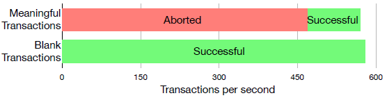

造成Fabric吞吐量低的原因：

1. 每一笔交易的读写集中，包含了对某一键的版本号。
2. 当对同一键进行修改/读取时，版本号会冲突，交易会被抛弃，视为无效交易。

下图是当对同一键值进行修改/读取的多笔交易到达时：

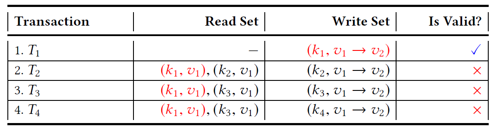

---

## Fabric 如何处理交易？

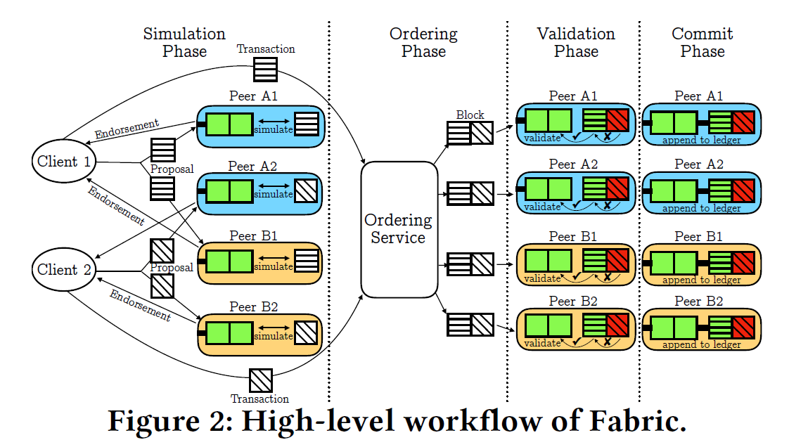

大致可以划分为四个阶段：

1. 模拟：对proposal进行模拟，得到相应的读写集，背书之后返回proposal response
2. 排序：client拿到多个proposal response之后，生成envelope发送给orderer排序
3. 验证：orderer将区块分发给commit peer进行验证
4. 提交入链：入链

---

## Fabric++的工作：

作者认为这样的处理流程是有瑕疵的：

- 生成交易：client可以随意的发起一笔与某一键值相关的交易
- 验证交易：交易的合法性在最后入链之前再检查

作者提出的解决办法：尽量做到“early abort”

1. 在ordering阶段，对涉及到同一键值的多个交易的顺序进行二次排列
2. 尽量把最后验证交易合法性的工作提前

# Transaction Reordering

将交易打包在一个区块内，重新对交易的顺序进行排序。

---

## 0.交易重排的重要性：

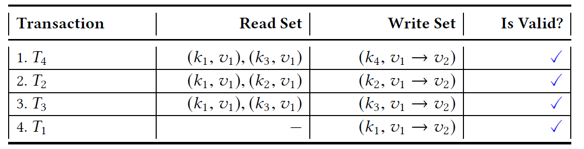

---

## 1.建图

对区块中的所有交易建立一个冲突图

案例前提：

1. 数据库中现有十个键值对
2. orderer打包了一个包含六个交易的区块

这六个交易的读写集如下：

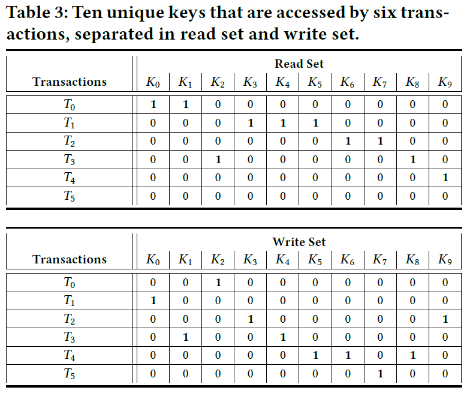

由前面的不当顺序案例可知，当完成对某笔写交易的验证工作后，之后的读交易将被视为无效交易，也就是读交易依赖于写交易，读交易尽可能的放在写交易的前面。

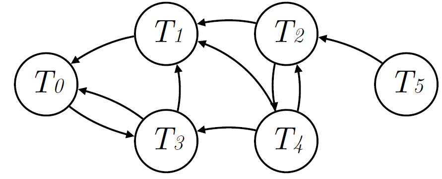

---

## 2.找环

标记出图中的所有的环

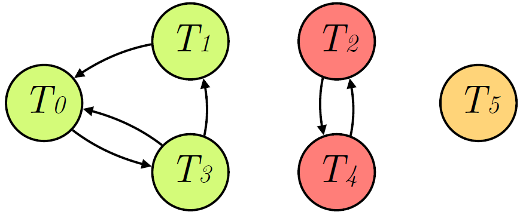

---

## 3.标数

标记出每一笔交易在各个环中出现的次数

1. c1 = T0 - T3 - T0
2. c2 = T0 - T3 - T1 - T0
3. c3 = T2 - T4 - T2

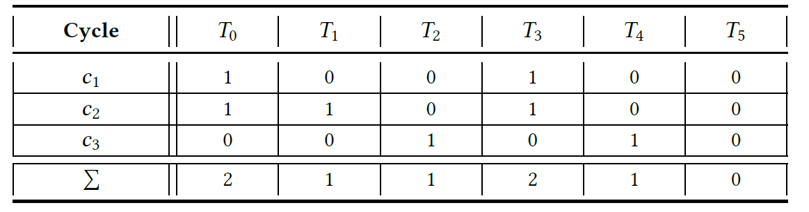

---

## 4.删交易

从在各个环中出现次数最多的交易开始逐步终止交易，直到解除所有的环。

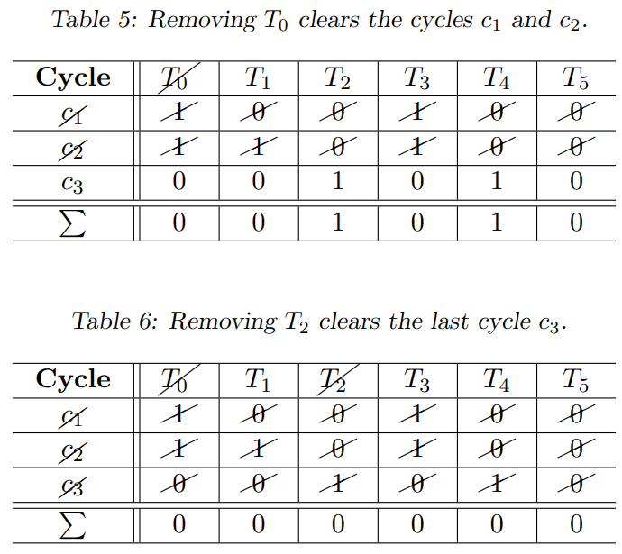

从出现次数最大的交易开始，将该交易从区块中移除，将包含该交易的所有环从上面表格中移除，同时对于出现在该环上面的交易，相应的减少它们的出现次数。重复上面过程直到上面表格为空。

1. 上面T0和T3的次数都是2，这里选择交易下标编号较小的一个，首先选择T0。
2. 将第一个和第二个环从表格中移除，移除交易T0，相应的，T3的次数也相应减少为0。
3. 现在上面表格只剩下环c3，将环3移除，移除交易T2。
4. 此时表格中没有环了，算法结束。

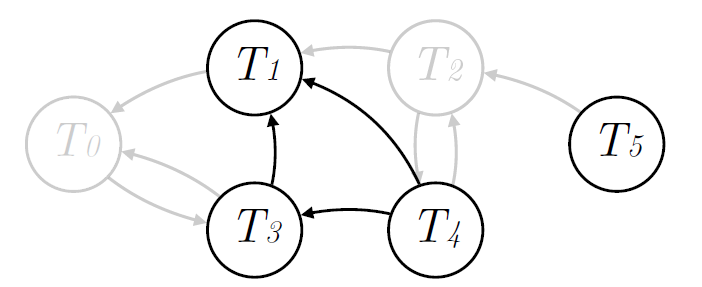

---

## 5.重排

在块中构建所有的交易顺序：

- 尽可能将读交易放在前面，写交易放在后面

在Hyperledger Fabric的重排序阶段，接收多少个交易之后才能打包成一个区块呢？

- 达到一定数量的交易。
- 达到了一定的数据大小。
- 从接收到这些交易的第一个交易开始，已经过去了一定的时间。

结合上面的算法，为了避免上面表格中的不同key的数量太多，影响算法性能，论文提出增加一个打包条件：

- 所接收到的所有交易中的不同key集合达到一定的数量。

---

# Early Transaction Abort

## Early Abort in the Simulation Phase

To realize early abort in the simulation phase, we first have to extend Fabric by a more fine-grained concurrency control mechanism, that allows for the parallel execution of simulation and validation
phase within a peer. With such a mechanism at hand,we have the chance of identifying stale reads during the simulation already.

作者设计了一种机制，模拟和验证可以同时进行。

- 问题：fabric中，模拟和验证不可以同时执行吗？？？

如果在模拟的时候发现读取的数据是stale read，则抛弃

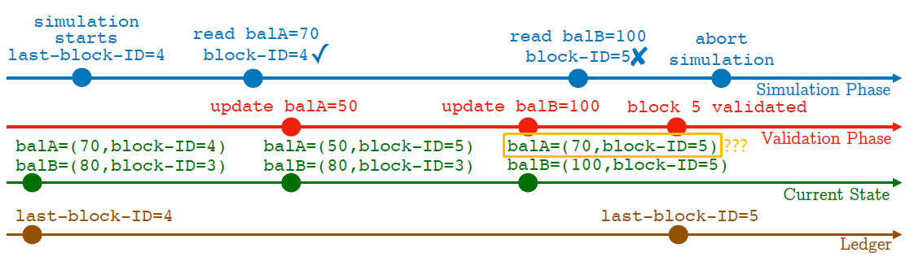

## Early Abort in the Ordering Phase

除去在reorder阶段删掉强连通图中的交易之外，如果在一个区块中含有两笔对同一键值进行读取的交易，则检查这两笔交易中的键值的版本号，如果不同则抛弃排在后面(可选)的那个交易。

| Transactions | Key/version |
| :----------: | :---------: |
|      T1      |    K1/V3    |
|      T2      |    K3/V1    |
|  **~~T3~~**  |  **K1/V2**  |

# 测试结果

| Terminology |                        Meaning                        |
| :---------: | :---------------------------------------------------: |
|     BS      |                      block size                       |
|     RW      | the number of read & written balances per transaction |
|     HR      | the probability for picking a hot account for reading |
|     HW      | the probability for picking a hot account for writing |
|     HSS     |          the number of hot account balances           |

# 读论文中的一些疑问：

1. 测试使用的是自己的测试框架，并没有使用官方的测试框架（如Caliper）
2. 对模拟和验证阶段的锁进行修改后，会不会影响系统的正常的工作？
3. 相较于“以增量的形式对同一个Key进行写入的多笔不同交易来写入数据”的这个方案，在orderer那里重新排序的优势与劣势在哪里？
4. early abort之后怎么将失败的结果反馈给client？
5. 为什么相较于以太坊，fabric更加的“并行”？simulate - order - validate - commit
6. 为什么作者说以太坊的扩展性不高？

