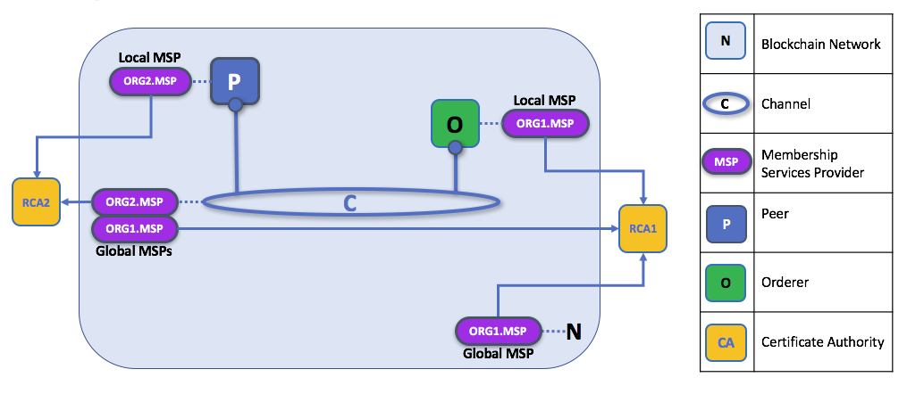

# 什么是MSP？

CA产生代表用身份的identity，MSP则包含的是一组permissioned identity。（按我的理解就是MSP决定了哪些identity是permissioned）

MSP 能够通过列举member的identity的方式来识别：哪些root CA 和intermediate CA可以定义一个域内的可信成员member（The MSP identifies which Root CAs and Intermediate CAs are accepted to define the members of a trust domain by listing the identities of their members,）。MSP也可以识别哪些CA有权利给member发放有效力的证书。

MSP的功能不仅仅局限于列举哪些member可以参与到区块链网络中，也不局限于列举哪些member有能力参与到一个channel中。

MSP可以给一个identity赋予一些权限，说白了MSP就是管理了一些具有某些权限的permissioned identity列表。比如每个人都有一个身份证，但是这并不代表你有参与人民代表大会的权利，而MSP维护了一个可参与人民代表大会的permissioned identity list。

# 为什么需要MSP？

前提：Fabric是一种只有被信任的节点才能参与到其中的区块链平台，因此参与者必须证明自己的身份。

* CA通过生成公钥和私钥的方法解决了怎样证明自己身份的问题。

* MSP用来解决了在不公开私钥的前提下，使网络上的其他节点信任该节点的问题。MSP定义了网络的参与者应该信任的一些组织。另外MSP给一些member提供了一些权限。

举例：在商店的支付场景中：CA类似于银行的角色，他负责发行银行卡；MSP类似政府财政部门，负责管理该商店只能用哪些银行卡进行支付。

假如你要假如到fabric区块链中，MSP能够是你参与到permissioned 区块链中：
 1. 首先你要有一个由CA颁发的identity
 2. 成为某一个Org的一个member，你需要被链上的其他成员认可。MSP就是怎样将你的identity链接到该组织的membership中的一种技术。通过将member的公钥添加到org的MSP中，实现membership。（The MSP is how the identity is linked to the membership of an organization. Membership is achieved by adding the member’s public key (also known as certificate, signing cert, or signcert) to the organization’s MSP.）
 3. 将MSP要么添加到consortium中，要么添加到channel中。
 4. 确保MSP包含在了网络中的policy definition里。

# MSP domains

MSP在区块链网络中的两个domain（译为层次？）出现

* Local MSP: locally on an actor's node(能够管理一个节点的一些权限？)
* Channel MSP: in channel configuration（能够管理一个channel的配置信息？）

## Local MSP

Local MSP 是为client，和node（peer 和 orderer）设计的：

* 可以使一些client 在交易时有付钱或收钱的权力
* 可以使一些node成为peer admin 的权利

因此一个node必须由一个local msp定义一些权限。

## Channel MSP

At the channel level , channel msp define administrative and participatory rights.

channel msp 定义了管理权，和参与权。

* 在同一个app channel 上的peer orderer都有同一个channel msp，这样就意味着如果一个org想要参与到一个channel中，该org的所有member都要被该channel msp赋权才行。
* 从这个角度来看，channel msp要比local msp 要高一级

*A channel config.json file includes two organization MSPs*

The system channel MSP 包含了参与到同一个ordering service的所有组织的MSP。这里所指的ordering service 是指一个orderer node集群所提供的服务。

## Existence of  Local MSP and Channel MSP

- Local MSP定义在client或node(peer / order)中的文件系统上，因此对于每一个节点来将，都只有一个Local MSP，来管理它的权限。
- Channel MSP也定义在各个节点的文件系统上，于local msp所不同的是，同一个Channel的各个节点所维护的Channel MSP是相同的一致的。

In this figure:

- the network system channel is administered by ORG1, 
- but another application channel can be managed by ORG1 and ORG2. 
- The peer is a member of and managed by ORG2, whereas ORG1 manages the orderer of the figure. 
- ORG1 trusts identities from RCA1, whereas ORG2 trusts identities from RCA2. 
- while ORG1 administers the network, ORG2.MSP does exist in the network definition.

# Org - MSP

org使用一个MSP管理org中的所有的member

## Organizational Units(OUs) an MSP

一个Org可能由于业务原因分为多个OU，如ORG1.MANUFACTURING and ORG1.DISTRIBUTION。当一个CA给一个节点颁发X.509证书时，证书里的OU字段表示了该identity属于哪一个业务，从而MSP决定了该identity具有什么样的权限，从而实现了权限管理。

## Node OU 

没怎么看懂，仔细看一下

# MSP Structure 

