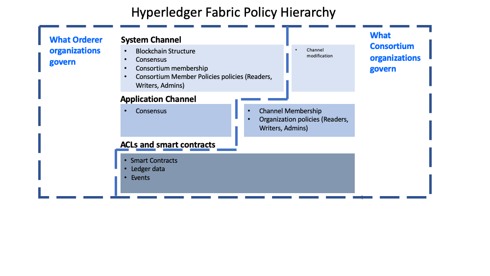

# 什么是 policy？

policy 是一系列的规则，这些规则定义了一些情况在什么样的条件下会达成怎样的结果。

fabric policy则定义了当对区块链网络，channel或者smart contract进行改动（添加或删减channel中的member，改变block的结构等）时，member怎样应该达成决定，以及达成什么样的决定。

# 为什么需要policy？

因为fabric相较于其他公链的区块链平台而言，他是一个permissioned chain，只要该平台的节点们达成一致就可以修改policy，而其他的平台不可以随便的更改policy，即便是要改policy也很困难。通过这种方式可以比较方便的更改policy。

另外就是没有规矩不成方圆，policy定义的是规则，按规章走总没错。

## Fabric怎么实现policy？

在Fabric的不同的层次都有policy需要实现

## System Channel

1. fabric区块链网络起源于ordering system channel
2. Ordering system 的policy定义了共识协议，怎样产生新区块，哪个org的member能调用ordering service，以及规定了哪些org能够交易等。

## Application Channel

1. Application channels 用来提供联盟中各个组织间的私密通信。
2. The policies in an application channel 控制一个channel内的member的增加或减少. 
3. Application channels  govern which organizations are required to approve a chaincode before the chaincode is defined and committed to a channel using the Fabric chaincode lifecyle. When an application channel is initially created, it inherits all the ordering service parameters from the orderer system channel by default. However, those parameters (and the policies governing them) can be customized in each channel.

## ACLs - access control lists

ACLs可以通过将资源与现有的policy联系在一起的方式，实现资源的权限控制(注意这里是访问资源的权限，如 functions on system chaincode, "GetBlockByNumber()")

ACL 具体是指定义在app channel配置文件中的一些policy，通过这些policy实现对资源的控制。

### Smart contract endorsement policies

智能合约中的背书策略规定了，具体哪些来自不同channel中的member(peer)可以执行和确认交易信息。

### Modification policies

Modification policies 规定了其他的policy是怎样更新的。因此，每个channel configuration中都有一个指针指向一个modification policy配置文件，因为其中规定了改channel的配置文件是怎样更新的。

# The fabric policy domains

The domains provide the ability to extend different privileges and roles to different organizations by allowing the founders of the ordering service the ability to establish the initial rules and membership of the consortium. 

The domains also allow the organizations that join the consortium to create private application channels, govern their own business logic, and restrict access to the data that is put on the network.

The system channel configuration and a portion of each application channel configuration provides the ordering organizations control over which organizations are members of the consortium, how blocks are delivered to channels, and the consensus mechanism used by the nodes of the ordering service.

The system channel configuration provides members of the consortium the ability to create channels. Application channels and ACLs are the mechanism that consortium organizations use to add or remove members from a channel and restrict access to data and smart contracts on a channel.

